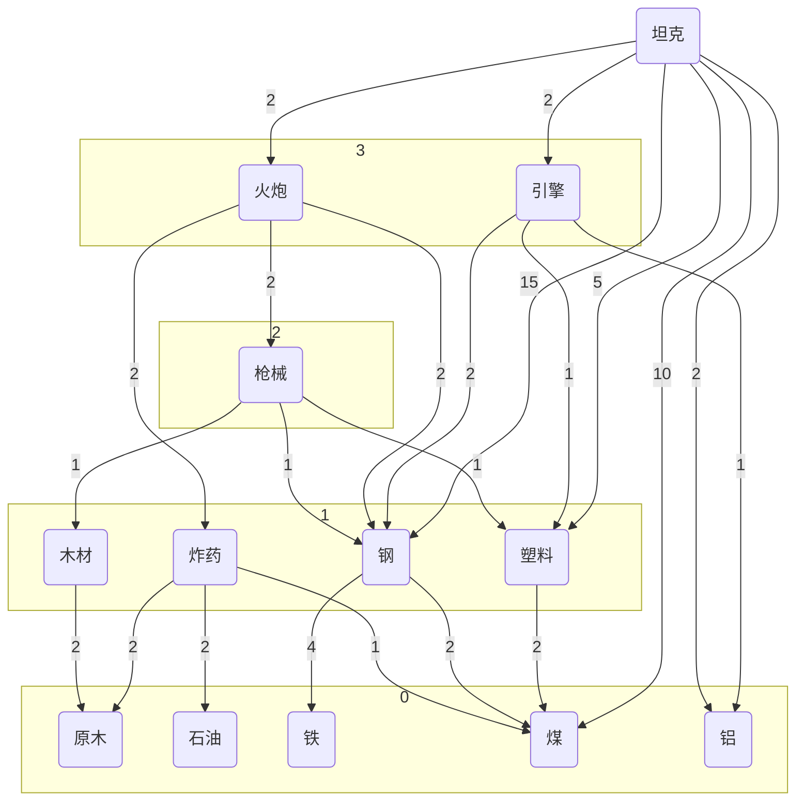

坦克 = 2引擎 + 15钢 + 5塑料 + 2火炮 + 2铝 + 10煤
= 2(2钢 + 铝 + 煤) + 15钢 + 5塑料 + 2(4原木 + 4石油 + 2煤 + 2钢 + 2塑料 + 4原木) + 2铝 + 10煤
= 4钢 + 2铝 + 2煤 + 15钢 + 5塑料 + 16原木 + 8石油 + 4煤 + 4钢 + 4塑料 + 2铝 + 10煤
= 4铝 + 19钢 + 9塑料 + 16原木 + 8石油 + 16煤
= 4铝 + 38铁        + 9塑料 + 16原木 + 8石油 + 35煤
= 4铝 + 29铁 + 10铬 + 9塑料 + 16原木 + 8石油 + 16煤 
