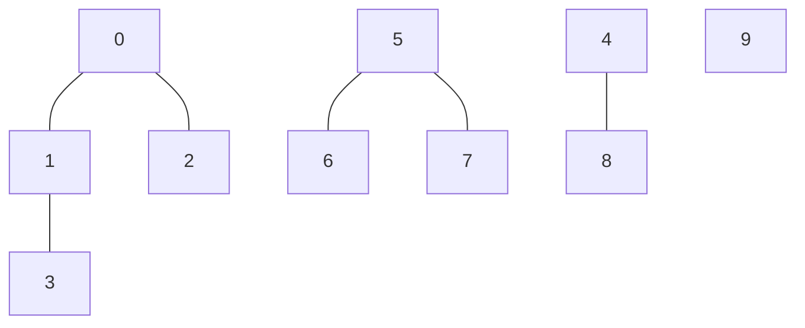

<!-- @import "/root.css" -->


```ditaa {cmd continue=ditaa}
/-----+
|hello|
+-----/

   /---\
   | a |
---/   \---


Color codes
/-------------+-------------\
|cRED RED     |cBLU BLU     |
+-------------+-------------+
|cGRE GRE     |cPNK PNK     |
+-------------+-------------+
|cBLK BLK     |cYEL YEL     |
\-------------+-------------/

+-----+
|{d}  |
|     |
|     |
+-----+

+-----+
|{s}  |
|     |
|     |
+-----+

+-----+
|{io} |
|     |
|     |
+-----+

----+  /----\  +----+
    :  |    |  :    |
    |  |    |  |{s} |
    v  \-=--+  +----+

*----*
|    |      /--*
*    *      |
|    |  -*--+
*----*


/-----------------\
| Things to do    |
| cGRE            |
| o Cut the grass |
| o Buy jam       |
| o Fix car       |
| o Make website  |
\-----------------/

+---+---+---+---+---+---+---+
| 1 | 2 | 3 | 4 | 5 | 6 | 7 |
+---+---+---+---+---+---+---+
```


```vega {style=background-color:#eeeeee}
{
  "$schema": "https://vega.github.io/schema/vega/v5.json",
  "width": 400,
  "height": 200,
  "padding": 5,

  "data": [
    {
      "name": "table",
      "values": [
        {"category": "A", "amount": 28},
        {"category": "B", "amount": 55},
        {"category": "C", "amount": 43},
        {"category": "D", "amount": 91},
        {"category": "E", "amount": 81},
        {"category": "F", "amount": 53},
        {"category": "G", "amount": 19},
        {"category": "H", "amount": 87}
      ]
    }
  ],

  "signals": [
    {
      "name": "tooltip",
      "value": {},
      "on": [
        {"events": "rect:mouseover", "update": "datum"},
        {"events": "rect:mouseout",  "update": "{}"}
      ]
    }
  ],

  "scales": [
    {
      "name": "xscale",
      "type": "band",
      "domain": {"data": "table", "field": "category"},
      "range": "width",
      "padding": 0.05,
      "round": true
    },
    {
      "name": "yscale",
      "domain": {"data": "table", "field": "amount"},
      "nice": true,
      "range": "height"
    }
  ],

  "axes": [
    { "orient": "bottom", "scale": "xscale" },
    { "orient": "left", "scale": "yscale" }
  ],

  "marks": [
    {
      "type": "rect",
      "from": {"data":"table"},
      "encode": {
        "enter": {
          "x": {"scale": "xscale", "field": "category"},
          "width": {"scale": "xscale", "band": 1},
          "y": {"scale": "yscale", "field": "amount"},
          "y2": {"scale": "yscale", "value": 0}
        },
        "update": {
          "fill": {"value": "steelblue"}
        },
        "hover": {
          "fill": {"value": "red"}
        }
      }
    },
    {
      "type": "text",
      "encode": {
        "enter": {
          "align": {"value": "center"},
          "baseline": {"value": "bottom"},
          "fill": {"value": "#333"}
        },
        "update": {
          "x": {"scale": "xscale", "signal": "tooltip.category", "band": 0.5},
          "y": {"scale": "yscale", "signal": "tooltip.amount", "offset": -2},
          "text": {"signal": "tooltip.amount"},
          "fillOpacity": [
            {"test": "isNaN(tooltip.amount)", "value": 0},
            {"value": 1}
          ]
        }
      }
    }
  ]
}
```


```ditaa {cmd args=["-s 1.5", "-E"] align=center}

+------+
| {o}  |
|      |
|      |
|      |
+------+


  /----\
/-/    \-\
\-\    /-/
  \----/
```

```ditaa {cmd args=["-s 1.5","-E"] align=center class=ditaa}
           y = x % 8
+----+----+----+----+----+----+----+----+
| 8  | 9  | 34 |    | 4  | 21 |    |    |
|cCEF|cFDD|cCEF|cEEE|cFDD|cCEF|cEEE|cEEE|
+----+----+----+----+----+----+----+----+
  0    1    2    3    4    5    6    7


+----+----+----+----+----+
| 17 | 12 |    |    |    |dict_overflow
|cFDD|cFDD|cEEE|cEEE|cEEE|
+----+----+----+----+----+

```
<!-- <style>
html body .ditaaPic rect{
  fill:#bbbbbb !important;
}
</style> -->




```python {cmd=true matplotlib=true}
import matplotlib.pyplot as plt
plt.plot([1,2,3, 4])
plt.show() # show figure
```
