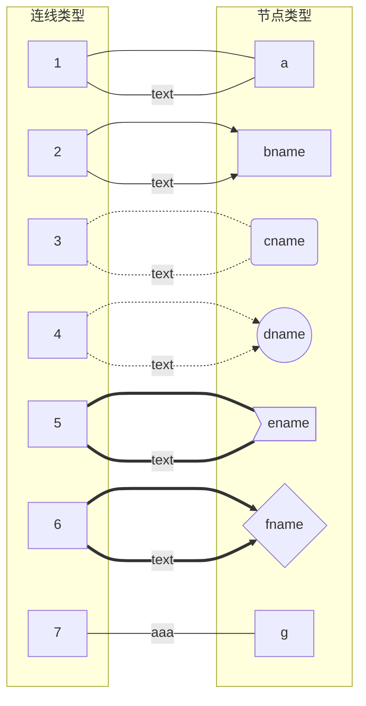

此处列举一些简单的 markdown 语法

生成目录：[TOC]

---

## 标题

```markdown
# 一级标题
## 二级标题
### 三级标题
#### 四级标题
##### 五级标题
###### 六级标题
```

---

## 字体

```markdown
*斜体*
**粗体**
***粗斜体***

_斜体_
__粗体__
___粗斜体___
```

---

## 列表

```markdown
无序列表
* 1
+ 2
- 3
```

* 1
* 2
* 3

+ 1
+ 2
+ 3

- 1
- 2
- 3

```markdown

有序列表

1. 第一
2. 第二

列表嵌套：
1. 第一
    - 1.1
    - 1.2
2. 第二
    - 2.1
    - 2.2
```

---

## 区块引用

```markdown
> 引用文段
> 还可以嵌套
> > 就像这样
> > 就可以了
>
> ok
```

> 引用文段
> 还可以嵌套
> > 就像这样
> > 就可以了
> 
> ok

---

## 水平分割线

```markdown
---

___

~~~
```

---

## 表格

```markdown
| 表头1 | 表头2 | 表头3 |
| ----- | ----- | ----- |
| 内容1 | 内容2 | 内容3 |
```
效果：

| 表头1 | 表头2 | 表头3 |
| ----- | ----- | ----- |
| 内容1 | 内容2 | 内容3 |

第二行的 `| --- |` 表示默认的对齐方式

`| :---: |` 为居中
`| :---- |` 为左对齐
`| ----: |` 为右对齐


进阶：合并单元格

这里可以选择打开设置中的 `Enable Extended Table Syntax`，启用合并单元格功能

```markdown
|   a   |   a   |   a   |
| :---: | :---: | :---: |
|   1   |   2   |   3   |
|   4   |       |   5   |

|   b   |   b   |   b   |
| :---: | :---: | :---: |
|   1   |   2   |   3   |
|   4   |   >   |   5   |

|   c   |   c   |   c   |
| :---: | :---: | :---: |
|   1   |   2   |   3   |
|   4   |   ^   |   5   |

|   d   |   d   |   d   |
| :---: | :---: | :---: |
|   1   |       |   3   |
|   ^   |       |   5   |

|   f   |       |       |
| :---: | :---: | :---: |
|   1   |   2   |   3   |
|   4   |   5   |   6   |
```
效果：

|   a   |   a   |   a   |
| :---: | :---: | :---: |
|   1   |   2   |   3   |
|   4   |       |   5   |

<br>

|   b   |   b   |   b   |
| :---: | :---: | :---: |
|   1   |   2   |   3   |
|   4   |   >   |   5   |

<br>

|   c   |   c   |   c   |
| :---: | :---: | :---: |
|   1   |   2   |   3   |
|   4   |   ^   |   5   |

<br>

|   d   |   d   |   d   |
| :---: | :---: | :---: |
|   1   |       |   3   |
|   ^   |       |   5   |

<br>

|   f   |       |       |
| :---: | :---: | :---: |
|   1   |   2   |   3   |
|   4   |   5   |   6   |

---

## 链接与图片

```markdown
链接：
[显示文字](url "提示文本")

图片：

```

---

## Html 标签

markdown 语法支持 html 标签

```markdown
<div style="width: 10%;height:10%;background-color:red">ab</div>
<font color=#63cfe4 style="font-family:仿宋; font-size:50px">字体</font>
```
效果
<div style="width: 10%;height:10%;background-color:red">ab</div>
<font color=#63cfe4 style="font-family:仿宋; font-size:50px">字体</font>

---


## 代码

```markdown
行内代码：`code`
```
`code`

<br>


代码段：

```c++
cout << "Hello World!" << endl;
```

格式

<pre style="background-color:#f8f8f8">
``` 语言
代码段
```
~~~ 语言
代码段
~~~
</pre>

<br>

MPE 附加的功能：

需在设置中启用 `Enable Script Execution`

可运行代码段，以 js 举例

<br>

### cmd

在代码段的语言后面加上 {cmd=xxx} 或 {cmd} 即可运行

只写 {cmd} 的话会启用默认的配置，有些语言可能无法运行，比如 js 就需要写 {cmd=node}

<pre style="background-color:#f8f8f8">
```javascript {cmd=node}
console.log(1);
```
</pre>

结果：
1

<br>

### id, continue
<pre style="background-color:#f8f8f8">
```javascript {cmd=node}
console.log(1);
```
```javascript {cmd=node continue}
console.log(2);
```
</pre>
结果：
12

<br>
<pre style="background-color:#f8f8f8">
```javascript {cmd=node id=1234567}
console.log(1);
```
```javascript {cmd=node id=1234567}
console.log(2);
```
```javascript {cmd=node continue=1234567}
console.log(3);
```
</pre>
结果：
13

<br>

更多的用法可以看 [教程](https://shd101wyy.github.io/markdown-preview-enhanced/#/zh-cn/code-chunk)

---
## `mermaid` 图形

详细请看：[教程](https://www.runoob.com/markdown/md-advance.html)

<pre style="background-color:#f8f8f8">
流程图 graph


</pre>

效果：


---

## 公式


这里只列举常用的，详细请百度

[文章](https://blog.csdn.net/qq_34342154/article/details/77870708)

`Latex` 公式语法

```markdown
$行内公式$

换行：\\

$$
行间公式1 \\
行间公式2
$$

$y=kx+b$

叉乘：$\times$
点乘：$\cdot$
上标：$a^{(2+3)}$
下标：$a_{(4+5)}$
分式：$\frac{1}{2}$
```

效果

$行内公式$

$$
行间公式1 \\
行间公式2
$$

$y=kx+b$

叉乘：$\times$
点乘：$\cdot$
上标：$a^{(2+3)}$
下标：$a_{(4+5)}$
分式：$\frac{1}{2}$


---


