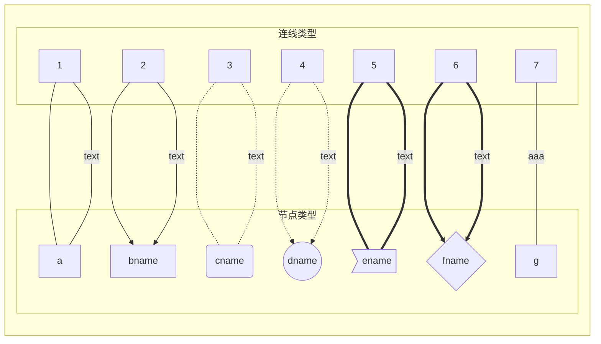
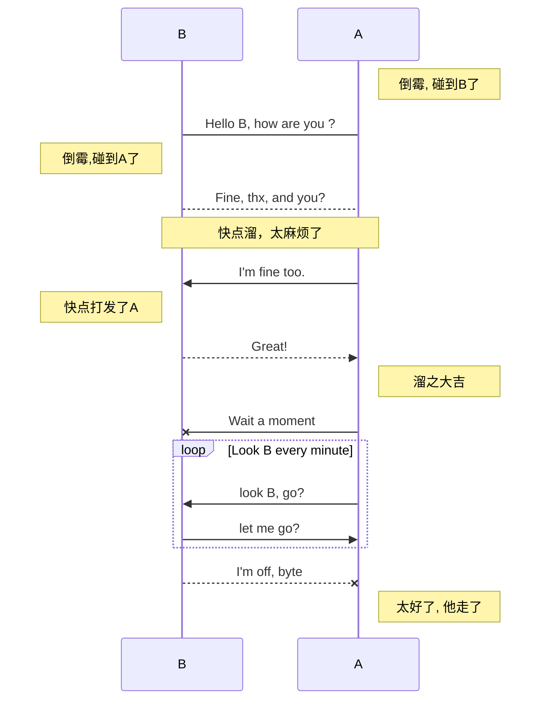
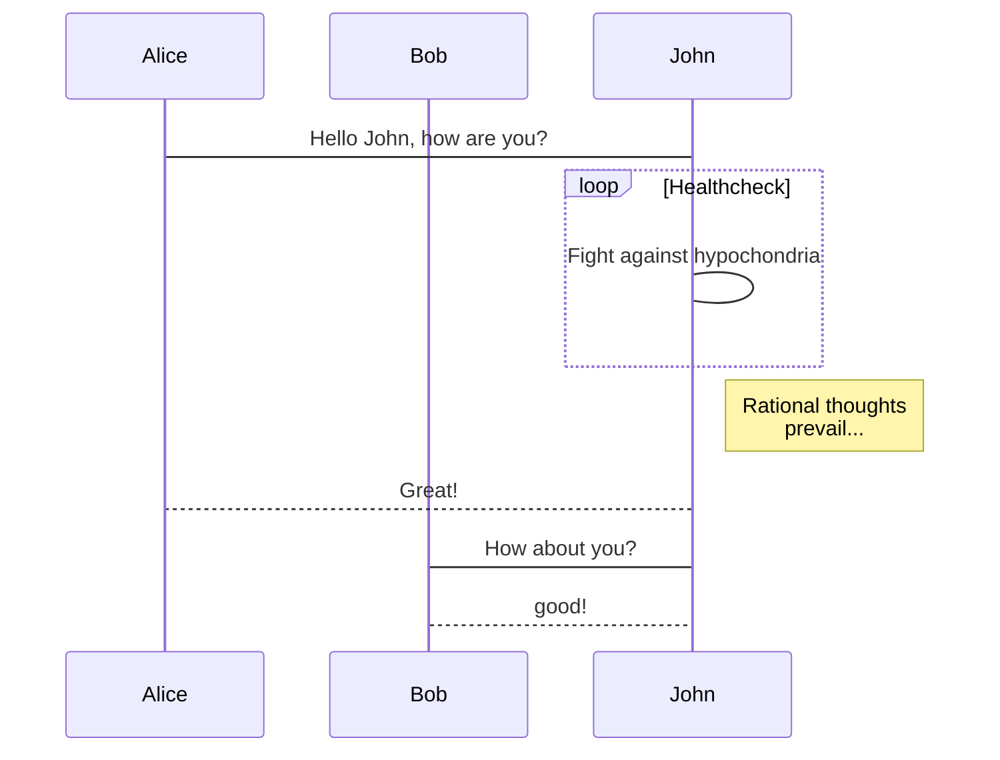
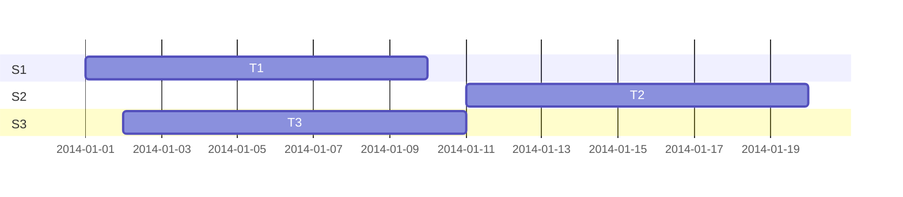
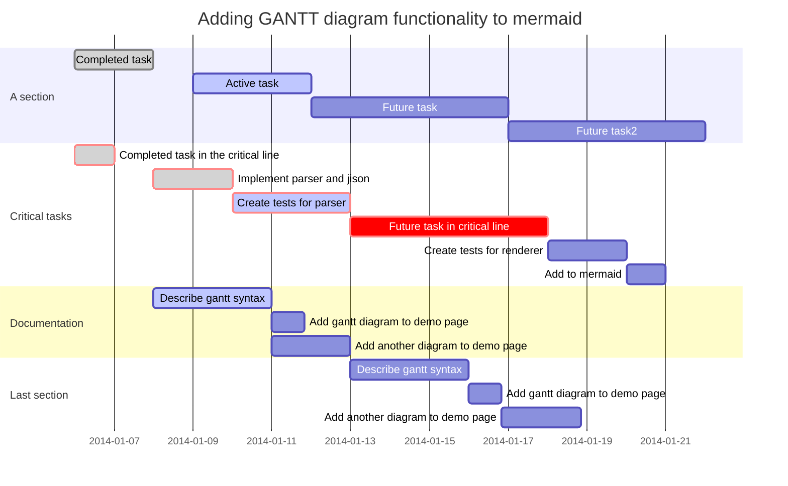

## 语法 & 工具

---

[TOC]

<br>

---


### 随机数生成器

``` cpp {cmd="cppsl"}
srand(time(NULL));
cout << "今天做 " <<(rand()%100*100 | rand()%100 );
```

---

### 悬浮提示（超链接）

[aaa](# "提示文本")

### 任务列表

- [x] 任务1
- [ ] 任务2


---

### 代码块class


行标及高亮
```javascript {.line-numbers highlight=[1-2, 4, 6-7]}
function add(x, y) {
  return x + y


}

```


---

### 模板

<!-- ****************************************************************************! -->
<!-- *************************************************************************todo -->
<!-- ***************************************************************************** -->
<!-- ****************************************************************************? -->

```cpp {cmd="cppal" id="start" hide}
//algorithm
class Solution{
public:
```


```cpp {cmd="cppal" continue="start"}
void algorithm(){

}
```
```cpp {cmd="cppal" continue hide}
};
Solution so;
//entry


//test
```
```cpp {cmd="cppal" continue}
1
2
3
```


<!-- ****************************************************************************? -->
<!-- ***************************************************************************** -->
<!-- *************************************************************************todo -->
<!-- ****************************************************************************! -->


---

### 测试

```cpp {cmd="cppal" continue="start"}
template <class T, class... Args>
void algorithm(T value, Args... args) {
    cout << value << endl;
    algorithm(args...);
}
void algorithm() {
    return;
}
```
```cpp {cmd="cppal" continue hide}
};
Solution so;
//entry

so.algorithm();

//test
```
```cpp {cmd="cppal" continue}


```

---

### markdown 图形语法


流程图 graph



---

序列图


---



---

甘特图




---

