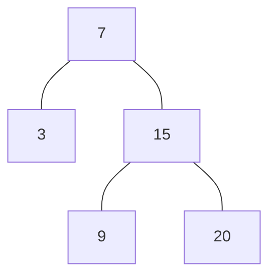

<!-- @import "/root.css" -->

## 二叉搜索树

二叉搜索树(Binary Search Tree, BST)是特殊的二叉树，其中每个结点的值满足：
- 小于（或等于）其右子树上所有的值；
- 大于（或等于）其左子树上所有的值。

<br>

### 二叉搜索树的操作

#### 搜索

根据BST的特性，对于每个节点：

- 如果目标值等于节点的值，则返回节点；
- 如果目标值小于节点的值，则继续在左子树中搜索；
- 如果目标值大于节点的值，则继续在右子树中搜索。


<br><hr class=short>

### BST 迭代器

设计一个 二叉搜索树迭代器，能够按照中序遍历顺序遍历二叉搜索树，具有以下操作：

- `hasNext()` : 返回有无下一个元素
- `next()` : 返回 BST 中，中序遍历的下一个元素

要求：迭代器初始化时指向一个不存在的元素，当第一次调用 `next()` 时，返回 BST 中最小元素

进阶：复杂度要求：
-  `next()` 和 `hasNext()` 均摊时间复杂度： \(O(1)\)
-  空间复杂度：\(O(h)\)，其中 h 是 BST 的高度

代码：

时间复杂度：
`next()` : 均摊 \(O(1)\)。如果需要遍历整棵树，那么需要将所有的结点都放入栈中，而且每个结点都进入了两次，总的时间是 \(2n\)；但遍历完整棵树，需要调用 \(n\) 次 `next()` 函数，而结点进栈是一次性的，每个结点在一次遍历中只会进 2 次栈，再次调用 `next()` 函数只会让未访问的结点进栈，所以均摊时间复杂度为 \(O(1)\)
`hasNext()` : \(O(1)\)

空间复杂度： \(O(h)\)。栈中最多会同时存有 h 个结点，`next()` 中的递归最多调用 h 次

```cpp {cmd=run}
//sf
class BSTIterator {
    stack<pair<TreeNode<int>*, bool>> stk;
public:
    BSTIterator(TreeNode<int>* root) {
        if (root)
            stk.push({root, 0});
    }
    
    int next() {
        if (!hasNext()) return 0;
        auto cur = stk.top();
        stk.pop();

        /* 0: 左子树未处理，自身再次入栈，并标记为 1，然后左子树入栈，递归处理左子树 */
        if (cur.second == 0) {
            stk.push({cur.first, 1});
            if (cur.first->left)
                stk.push({cur.first->left, 0});
            return next();
        } else {
        /* 1: 左子树已处理，右子树入栈，然后返回自身 */
            if (cur.first->right)
                stk.push({cur.first->right, 0});
            return cur.first->val;
        }
    }
    
    bool hasNext() {
        return !stk.empty();
    }
};
```
```cpp {cmd=run continue hide}
//entry
modify_source = 1;
TreeNode<int> *tree;
input >> tree;
if (input) {
    output << tree->toMermaid();
```
测试代码：
```cpp {cmd=run continue}
    BSTIterator it(tree);
    output << it.next() << ' ';
    output << it.next() << ' ';
    output << it.next() << ' ';
    output << it.next() << ' ';
    output << (it.hasNext() ? "true" : "false");
```
```cpp {cmd=run continue hide}
}
//test
```
测试数据：
```cpp {cmd=run continue modify_source}
[7,3,15,null,null,9,20]
```
结果：
<!-- code_chunk_output -->

<div class=code-output> 


3 7 9 15 true

<hr class=code-hr> average time: 0 ms


</div> 


<!-- /code_chunk_output -->


<br><br><hr class=short>

### 力扣例题

- [x] [98. 验证二叉搜索树](https://leetcode-cn.com/problems/validate-binary-search-tree/)

- [x] [`BST 迭代器`](#bst-迭代器) [173. 二叉搜索树迭代器](https://leetcode-cn.com/problems/binary-search-tree-iterator/)

<br>
<br>
<br>

---
