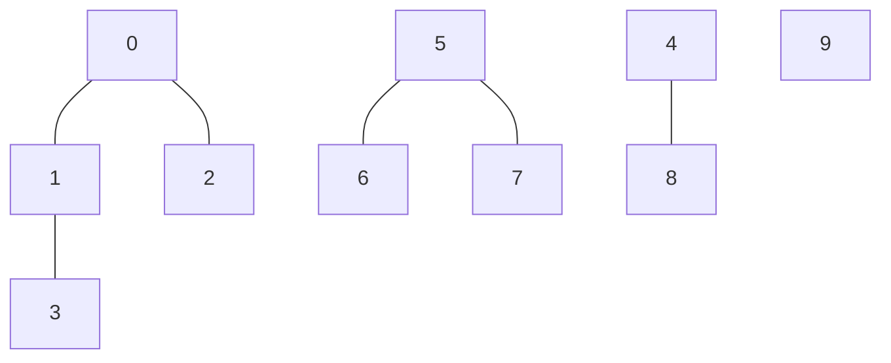
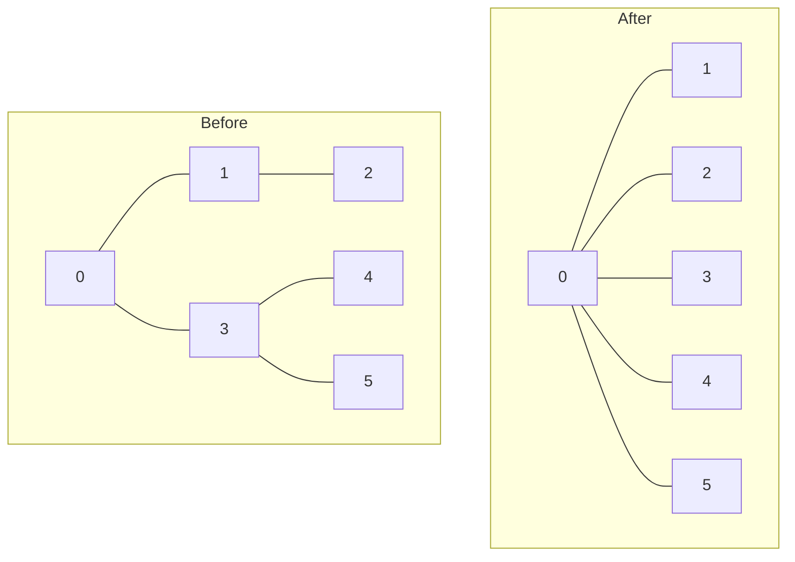
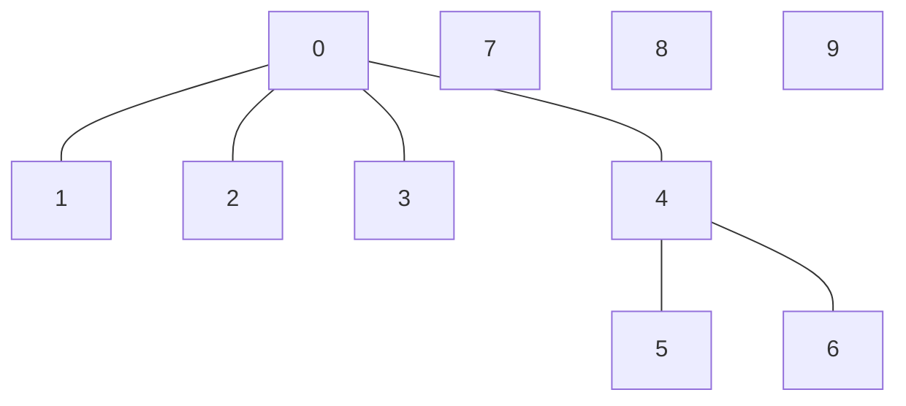
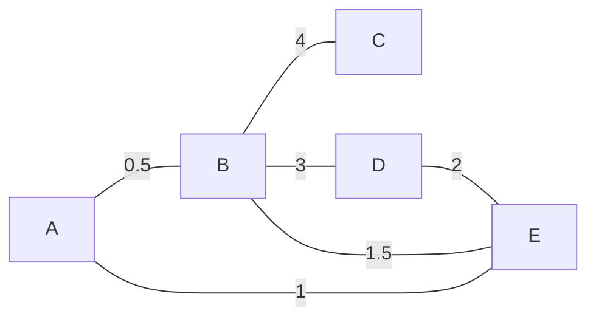
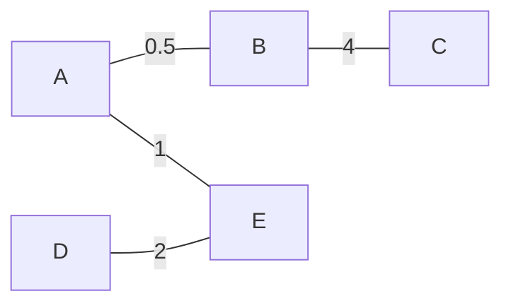
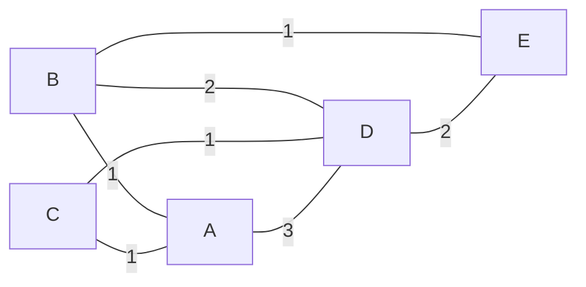
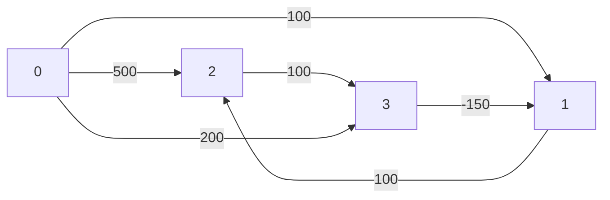
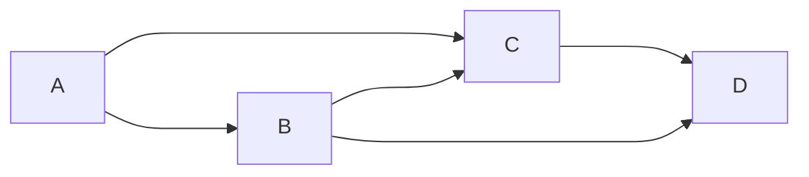

<!-- @import "/root.css" -->

## 图
<hr class=short>

[【图】](#Graph)

### 并查集

#### 一些定义：
父结点：顶点的直接父亲结点。（自己也可以是自己的父结点）
根结点：没有父节点的结点。（由于自己可以是自己的父结点，所以自己也可以是自己的根结点）

<br>

#### 并查集基本思想：
将一系列元素按照他们的关系合并到一系列集合中，并选取一个代表元素（父节点或根节点）。若查询两个元素间有无关系，则只需要返回他们各自的代表元素并比较，就能知道他们是否有关系（是否在同一个集合中）

<br>

#### 并查集编程思想：
例：

查询上图中 $(0, 3)$ $(1, 5)$ $(7,8)$ 的连通性

解法：

1. 生成并查集数组 $root[10]$
  初始化： `root[i] = i` 
  将 `root[i]` 设为 `i` 的父结点，无父结点就设为 `i` 本身


```ditaa {cmd args=["-s 1.5", "-E"] align=center class=ditaa}
     +--+--+--+--+--+--+--+--+--+--+
root |0 |0 |0 |1 |4 |5 |5 |5 |4 |9 |
     +--+--+--+--+--+--+--+--+--+--+
      0  1  2  3  4  5  6  7  8  9
```

1. 查询 $0$ 和 $3$ 的根节点 （find 函数）
  `find(i)`: 
  - 当 `root[i] == i` 时，返回 `i` （ `i` 是根节点）
  - 当 `root[i] != i` 时，返回 `find(root[i])` （ `i` 不是根节点）

3. 若新增连接 $(4, 7)$ ，`root` 如何变化？ （union 函数）
  `union(i, j)`: `k = find(i); root[k] = j;`

<br>

#### 普通并查集两种实现方法

##### QuickFind 的并查集

`root` 数组存放每个结点的根结点
特点：

- `find` : $O(1)$ ，直接返回的就是根结点
- `union` : $O(n)$ ，需要将的其中一个的集合全部的根结点更新


实现：
```cpp {cmd=run}
//class
class UnionFind_Test {
  vector<int> root;

public:
  UnionFind_Test(int size){
      root.resize(size);
      for(int i = 0; i < root.size(); ++i)
          root[i] = i;
  }
  int find(int x){
      return root[x];
  }
  void union_(int x, int y){
      int rootY = find(y);
      if (find(x) != rootY)
          for(auto& i : root)
              if(i == rootY)
                  i = rootY;
  }
};
```

| QuickFind  | 构造函数 |  find  | union  |
| :--------: | :------: | :----: | :----: |
| 时间复杂度 |  $O(n)$  | $O(1)$ | $O(n)$ |

<br>

##### QuickUnion 的并查集

`root` 数组存放每个结点的父结点
特点：

- `find` : $O(h)$ ，$h$ 为并查集形成的树的高度，需要寻找才能返回根结点
- `union` : $O(1)$ ~ $O(n)$，时间复杂度取决于 `find` 函数 ，只需要将的其中一个结点的父结点更新


实现：

```cpp {cmd=run}
//class
class UnionFind_Test {
    vector<int> root;

public:
    UnionFind_Test(int size){
        root.resize(size);
        for(int i = 0; i < root.size(); ++i)
            root[i] = i;
    }
    int find(int x){
        while (x != root[x])
            x = root[x];
        return x;
    }
    void union_(int x, int y){
        int rootX = find(x);
        int rootY = find(y);
        if (rootX != rootY)
            root[rootY] = rootX;
    }
};
```

| QuickUnion | 构造函数 |  find  | union  |
| :--------: | :------: | :----: | :----: |
| 时间复杂度 |  $O(n)$  | $O(d)$ | $O(d)$ |

$d$ 为并查集中结点所在的树的平均深度

<br>

#### 按秩合并的 QuickUnion
`find` 函数不变
`union` 函数：低树往高树合并（谁高谁做根结点）

实现：

```cpp {cmd=run}
//class
class UnionFind_Test{
    vector<int> root;
    vector<int> rank;   // rank 数组储存每个结点所在的高度

public:
    UnionFind_Test(int size) {
        root.resize(size);
        rank.resize(size);
        for(int i = 0; i < root.size(); ++i) {
            root[i] = i;
            rank[i] = 1;
        }
    }
    int find(int x) {
        while (x != root[x])
            x = root[x];
        return x;
    }
    void union_(int x, int y) {
        int rootX = find(x);
        int rootY = find(y);
        if (rootX != rootY) {
            if (rank[rootX] > rank[rootY]) {
                root[rootY] = rootX;
            } else if (rank[rootX] < rank[rootY]) {
                root[rootX] = rootY;
            } else {
                root[rootY] = rootX;
                rank[rootX] += 1;
            }
        }
    }
};
```

| 按秩合并的QuickUnion | 构造函数 |    find     |    union    |
| :------------------: | :------: | :---------: | :---------: |
|      时间复杂度      |  $O(n)$  | $O(\log n)$ | $O(\log n)$ |

<br>

#### 路径压缩的 QuickUnion
调用 `find` 函数后，将该查找路径上的所有结点的父结点，都改为根结点

路径压缩本质是 执行 `find()` 的过程将下图左图，转化为右图



实现：
```cpp {cmd=run}
//class
class UnionFind_Test {
    vector<int> root;

public:
    UnionFind_Test(int size) {
        root.resize(size);
        for(int i = 0; i < root.size(); ++i)
            root[i] = i;
    }
    int find(int x) {
        if (x == root[x])
            return x;
        return root[x] = find(root[x]);
    }
    void union_(int x, int y) {
        int rootX = find(x);
        int rootY = find(y);
        if (rootX != rootY)
            root[rootY] = rootX;
    }
};
```

| 路径压缩的QuickUnion | 构造函数 |    find     |    union    |
| :------------------: | :------: | :---------: | :---------: |
|      时间复杂度      |  $O(n)$  | $O(\log n)$ | $O(\log n)$ |

<br>

#### 基于路径压缩的按秩合并优化的并查集

`find()` 路径优化
`union()` 按秩合并

实现：
```cpp {cmd=run}
//class
class UnionFind_Test {
public:
    vector<int> root;
    vector<int> rank;

    UnionFind_Test(int size) {
        root.resize(size);
        rank.resize(size);
        for(int i = 0; i < root.size(); ++i){
            root[i] = i;
            rank[i] = 1;
        }
    }
    int find(int x) {
        if (x == root[x])
            return x;
        return root[x] = find(root[x]);
    }
    void union_(int x, int y) {
        int rootX = find(x);
        int rootY = find(y);
        if (rootX != rootY) {
            if (rank[rootX] > rank[rootY]) {
                root[rootY] = rootX;
            } else if (rank[rootX] < rank[rootY]) {
                root[rootX] = rootY;
            } else {
                root[rootY] = rootX;
                rank[rootX] += 1;
            }
        }
    }
};
```

```cpp {cmd=run continue output=markdown modify_source}
//use
UnionFind_Test uf(10);
uf.union_(0,1);
uf.union_(0,2);
uf.union_(1,3);

uf.union_(4,5);
uf.union_(5,6);

uf.union_(2,4);

// output
cout << "```mermaid \n" << "graph TD; \n";
for (int i = 0; i < uf.root.size(); ++i) {
    if(uf.root[i] != i)
        cout << uf.root[i] << " --- " << i << endl;
    else
        cout << i << endl;
}
cout << "``` \n";
```

<!-- code_chunk_output -->




<!-- /code_chunk_output -->


<br><br><hr class=short>

### 深度优先搜索

方法：使用栈

输入：

    一维数组 V ，V[i] 表示顶点 i
    二维数组 E ，E[i][j] 表示点 i 和点 j 之间是否相连（或相连的权值）

输出：深度优先搜索遍历序列

代码

```cpp {cmd=run}
//sf
string DepthFirstSearch(vector<string>& V, vector<vector<int>>& E) {
    vector<bool> visit(V.size(), false);
    stack<int> S;
    stringstream res("");
    S.push(0);
    while (!S.empty()) {
        int i = S.top();
        S.pop();
        if(visit[i]) continue;
        res << V[i] <<' ';
        visit[i] = true;
        for (int j = 0; j < E[i].size(); ++j) {
            if (E[i][j]) {
                S.push(j);
            }
        }
    }
    return res.str();
}
```
```cpp {cmd=run continue hide}
//entry
 modify_source = 1;
vector<string> V;
vector<vector<int>> E; 

input >> V >> E;
if(input){
    output << DepthFirstSearch(V, E);
}
//test
```
```cpp {cmd=run continue modify_source}
[A,B,C,D,E,F]
[
    [1,1,1,1,0,0],
    [1,1,0,0,1,1],
    [1,0,1,0,1,0],
    [1,0,0,1,1,0],
    [0,1,1,1,1,1],
    [0,1,0,0,1,1]
]
```

<!-- code_chunk_output -->

<div class=code-output> 

A D E F B C 

<hr class=code-hr> average time: 0 ms


</div> 


<!-- /code_chunk_output -->

<br><br><hr class=short>

### 广度优先搜索

方法：使用队列（跟dfs代码几乎一样，就是栈换成了队列）

输入：

    一维数组 V ，V[i] 表示顶点 i
    二维数组 E ，E[i][j] 表示点 i 和点 j 之间是否相连（或相连的权值）

输出：广度优先搜索遍历序列

代码

```cpp {cmd=run}
//sf
string BreathFirstSearch(vector<string>& V, vector<vector<int>>& E) {
    vector<bool> visit(V.size(), false);
    queue<int> Q;
    stringstream res("");
    Q.push(0);
    while (!Q.empty()) {
        int i = Q.front();
        Q.pop();
        if(visit[i]) continue;
        res << V[i] <<' ';
        visit[i] = true;
        for (int j = 0; j < E[i].size(); ++j) {
            if (E[i][j]) {
                Q.push(j);
            }
        }
    }
    return res.str();
}
```
```cpp {cmd=run continue hide}
//entry
 modify_source = 1;
vector<string> V;
vector<vector<int>> E; 

input >> V >> E;
if(input){
    output << BreathFirstSearch(V, E);
}
//test
```
```cpp {cmd=run continue modify_source}
[A,B,C,D,E,F]
[
    [1,1,1,1,0,0],
    [1,1,0,0,1,1],
    [1,0,1,0,1,0],
    [1,0,0,1,1,0],
    [0,1,1,1,1,1],
    [0,1,0,0,1,1]
]
```

<!-- code_chunk_output -->

<div class=code-output> 

A B C D E F 

<hr class=code-hr> average time: 0 ms


</div> 


<!-- /code_chunk_output -->

<br><br><hr class=short>

### 所有路径

求图中两点的所有路径，且每个结点只能经过一次

输入：

    一维数组 V，V[i] 表示顶点 i
    二维数组 E，E[i][j] 表示点 i 和点 j 之间是否相连（或相连的权值）
    顶点 a, b

输出：

    数组 O，存放了 a->b 的所有路径

代码

深度优先搜索所有路径

```cpp {cmd=run}
//sf
vector<vector<string>> dfsPath(vector<string>& V, vector<vector<int>>& E, int a, int b) {
    vector<bool> visit(V.size(), false);
    stack<vector<int>> S;
    vector<vector<string>> res;
    vector<int> start{a};
    S.push(start);

    while (!S.empty()) {
        vector<int> cur = S.top();
        S.pop();
        int i = cur.back();

        /* 判断是否到达终点 */
        if (i == b) {
            vector<string> temp;
            for(int j = 0; j < cur.size(); ++j) {
                temp.push_back(V[cur[j]]);
            }
            res.push_back(temp);
            continue;
        }

        /* 获取下一结点，并将路径入栈 */
        for(int j = 0; j < E[i].size(); ++j) {
            if(E[i][j] && i != j) {

                /* 判断是否已访问 */
                bool visit = false;
                for(int k = 0; k < cur.size(); ++k) {
                    if(j == cur[k])
                        visit = true;
                }
                if(visit) continue;

                /* 结点 j 加入路径 */
                vector<int> temp = cur;
                temp.push_back(j);
                S.push(temp);
            }
        }
    }

    return res;
}
```
```cpp {cmd=run continue hide}
//entry
 modify_source = 1;
vector<string> V;
vector<vector<int>> E; 
int a, b;

input >> V >> E >> a >> b;
if(input){
    output << dfsPath(V, E, a, b);
}
//test
```
```cpp {cmd=run continue modify_source}
[A,B,C,D,E,F]
[
    [1,1,1,1,0,0],
    [1,1,0,0,1,1],
    [1,0,1,0,1,0],
    [1,0,0,1,1,0],
    [0,1,1,1,1,1],
    [0,1,0,0,1,1]
]
0 1
```

<!-- code_chunk_output -->

<div class=code-output> 

[[A,D,E,F,B],[A,D,E,B],[A,C,E,F,B],[A,C,E,B],[A,B] ]

<hr class=code-hr> average time: 0 ms


</div> 


<!-- /code_chunk_output -->

<br><br>

广度优先搜索所有路径

```cpp {cmd=run}
//sf
vector<vector<string>> dfsPath(vector<string>& V, vector<vector<int>>& E, int a, int b) {
    vector<bool> visit(V.size(), false);
    queue<vector<int>> S;
    vector<vector<string>> res;
    vector<int> start{a};
    S.push(start);

    while (!S.empty()) {
        vector<int> cur = S.front();
        S.pop();
        int i = cur.back();

        /* 判断是否到达终点 */
        if (i == b) {
            vector<string> temp;
            for(int j = 0; j < cur.size(); ++j) {
                temp.push_back(V[cur[j]]);
            }
            res.push_back(temp);
            continue;
        }

        /* 获取下一结点，并将路径入栈 */
        for(int j = 0; j < E[i].size(); ++j) {
            if(E[i][j] && i != j) {

                /* 判断是否已访问 */
                bool visit = false;
                for(int k = 0; k < cur.size(); ++k) {
                    if(j == cur[k])
                        visit = true;
                }
                if(visit) continue;

                /* 结点 j 加入路径 */
                vector<int> temp = cur;
                temp.push_back(j);
                S.push(temp);
            }
        }
    }

    return res;
}
```
```cpp {cmd=run continue hide}
//entry
 modify_source = 1;
vector<string> V;
vector<vector<int>> E; 
int a, b;

input >> V >> E >> a >> b;
if(input){
    output << dfsPath(V, E, a, b);
}
//test
```
```cpp {cmd=run continue modify_source}
[A,B,C,D,E,F]
[
    [1,1,1,1,0,0],
    [1,1,0,0,1,1],
    [1,0,1,0,1,0],
    [1,0,0,1,1,0],
    [0,1,1,1,1,1],
    [0,1,0,0,1,1]
]
0 1
```

<!-- code_chunk_output -->

<div class=code-output> 

[[A,B],[A,C,E,B],[A,D,E,B],[A,C,E,F,B],[A,D,E,F,B] ]

<hr class=code-hr> average time: 0 ms


</div> 


<!-- /code_chunk_output -->

<br><br><hr class=short>

### 最小生成树

`最小生成树` 是指带权无向图中，生成的总权重最小的，具有所有顶点的连通子图

#### 切分定理

> 切分：指将图切成两个部分
> 
> 横切边：如果一条边的两个顶点属于切分的两个部分，则为横切边
> 
> 切分定理：在连通带权无向图中，给定任意的切分，如果有一条横切边的权值严格小于所有其他横切边，则这条边必然属于图的最小生成树的一条边

<br>

#### Kruskal 算法

[【贪心法】](#贪心法)

Kruskal 算法适合简单图

方法：

1. 将所有边从小到大排序（使用最小堆，每次选取堆顶元素即可）
2. 将小边依次加入最小生成树中，形成环则跳过（使用并查集查询两点是否已在同一颗树中）
3. 直到选择 `n - 1` 条边为止


代码思路：

需要使用：堆，并查集
1. 将所有边插入堆中
2. 取出堆顶的边 `(p1,p2)`，在并查集中判断 `p1` 和 `p2` 是否已连接，若是，则丢弃重取
3. 若 `p1` `p2` 未连接，则边 `(p1,p2)` 为最终结果生成树的其中一条边，在并查集中连接 `p1` `p2`
4. 循环 23. 直到选出了 `n-1` 条边


```cpp {cmd=run}
//sf
/* 边 */
template<class CostType>
class Edge{
public:
    int p1;
    int p2;
    CostType cost;

    Edge(int point1, int point2, CostType c):p1(point1), p2(point2), cost(c){}
};

/* 堆使用的比较函数 */
auto com = [](Edge<double> e1, Edge<double> e2)->bool{return e1.cost < e2.cost;};


/* Kruskal 算法 */
template<class Type, class CostType>
Graph<Type, 0, 1, CostType> Kruskal(Graph<Type, 0, 1, CostType>& graph) {
    Heap<Edge<CostType>, decltype(com)> edges(com);

    /* 初始化堆，将所有边插入到堆中 */
    for (int i = 0; i < graph.edge.size(); ++i) {
        for (int j = i + 1; j < graph.edge[i].size(); ++j) {
            if(graph.edge[i][j] > 0){
                edges.push(Edge<CostType>(i, j, graph.edge[i][j]));
            }
        }
    }

    /* 初始化并查集 */
    UnionFind uf(graph.vertex.size());
    int n = graph.vertex.size() - 1;

    /* 结果图的邻接矩阵 */
    vector<vector<CostType>> edgeRes(graph.vertex.size(), vector<CostType>(graph.vertex.size(), 0));

    /* 开始选边 */
    for(int i = 0; i < n; ++i) {
        /* 取出最小堆顶的边 */
        Edge<CostType> e = edges.top();
        edges.pop();
        /* 在并查集中查询这条边的两点是否已经在同一个生成树 */
        if(!uf.connected(e.p1, e.p2)){
            /* 不是则连接，并将权值赋给结果邻接矩阵 */
            uf.unite(e.p1, e.p2);
            edgeRes[e.p1][e.p2] = edgeRes[e.p2][e.p1] = e.cost;
        }
        /* 已在同一邻接矩阵，则需要多找一条边 */
        else
            ++n;
    }

    /* 生成结果图 */
    Graph<Type, 0, 1, CostType> res(graph.vertex, edgeRes);
    return res;
}
```
```cpp {cmd=run continue hide}
//entry
modify_source = true;
Graph<string, 0, 1, double> g;
input >> g;
if(input) {
    output << "原图：\n" << g << "最小生成树：\n" << Kruskal(g);
}
//test
```
```cpp {cmd=run continue modify_source}
[A,B,C,D,E]
[
    [0,0.5,0,0,1],
    [0.5,0,4,3,1.5],
    [0,4,0,0,0],
    [0,3,0,0,2],
    [1,1.5,0,2,0]
]
```

<!-- code_chunk_output -->

<div class=code-output> 

原图：

最小生成树：



<hr class=code-hr> average time: 1 ms


</div> 


<!-- /code_chunk_output -->


<br><br>

#### Prim 算法

[【贪心法】](#贪心法)

Prim 算法适合复杂图

思路：
1. 将顶点分为未访问和已访问两个集合（使用 `visit` 数组标记）
2. 将第一个顶点加入已访问集合，遍历已访问集合，对于连接已访问集合中的顶点的最短的边（使用 `堆` 数据结构），若这条边的另一个顶点未访问，则加入已访问集合
3. 直到未访问集合为空

代码思路：

需要使用：visit 数组， 堆
1. 将点 0 加入已访问，并用 `i` 维护最新加入的结点
2. 对于最新加入的结点 `i`，将它的连接到所有未访问结点插入堆中
3. 取堆顶的边`(p1,p2)`，判断点 `p2` 是否已访问，若是，则丢弃重取
4. 若 `p2` 未访问，则边 `(p1,p2)` 为最终结果生成树的其中一条边，将点 `p2` 加入已访问，令 `i = p2`
5. 循环 234. 直到所有点已访问

```cpp {cmd=run}
//sf
/* 边 */
template<class CostType>
class Edge{
public:
    int p1;
    int p2;
    CostType cost;

    Edge(int point1, int point2, CostType c):p1(point1), p2(point2), cost(c){}
};

/* 堆使用的比较函数 */
auto com = [](Edge<double> e1, Edge<double> e2)->bool{return e1.cost < e2.cost;};

/* Prim 算法 */
template<class Type, class CostType>
Graph<Type, 0, 1, CostType> Prim(Graph<Type, 0, 1, CostType> graph) {
    /* visit 数组初始化 */
    vector<bool> visit(graph.vertex.size(), false);
    /* 堆初始化 */
    Heap<Edge<CostType>, decltype(com)> edges(com);
    /* 结果图的临界矩阵 */
    vector<vector<CostType>> edgeRes(graph.vertex.size(), vector<CostType>(graph.vertex.size(), 0));

    /* 将点 0 标记为已访问，i 维护当前最新加入的边 */
    int i = 0;
    visit[i] = true;
    int n = graph.vertex.size() - 1;

    /* 开始选点 */
    while(n > 0) {
        /* 对于所有未访问的点 j，将边 i->j 加入堆 */
        for(int j = 0; j < visit.size(); ++j) {
            if(visit[j]) continue;
            if(graph.edge[i][j] > 0)
                edges.push(Edge<CostType>(i, j, graph.edge[i][j]));
        }

        /* 从堆中取出边 p1->p2 */
        Edge<CostType> e = edges.top();
        edges.pop();

        /* p1 肯定是已访问，判断 p2 是否访问，如果已访问，则为不需要的边，丢弃 */
        while(visit[e.p2]){
            e = edges.top();
            edges.pop();
        }

        /* 将点 p2 加入已访问集合 */
        i = e.p2;
        visit[i] = true;
        --n;
        edgeRes[e.p1][e.p2] = edgeRes[e.p2][e.p1] = e.cost;
    }

    Graph<Type, 0, 1, CostType> res(graph.vertex, edgeRes);
    return res;
}
```
```cpp {cmd=run continue hide}
//entry
modify_source = true;
Graph<string, 0, 1, double> g;
input >> g;
if(input) {
    output << "原图：\n" << g << "最小生成树：\n" << Prim(g);
}
//test
```
```cpp {cmd=run continue modify_source}
[A,B,C,D,E]
[
    [0,0.5,0,0,1],
    [0.5,0,4,3,1.5],
    [0,4,0,0,0],
    [0,3,0,0,2],
    [1,1.5,0,2,0]
]
```

<!-- code_chunk_output -->

<div class=code-output> 

原图：

最小生成树：


<hr class=code-hr> average time: 0 ms


</div> 


<!-- /code_chunk_output -->


<br><br><hr class=short>

### 最短路径

一些定义：

正权图：所有边权值和 $\ge 0$
负权图：所有边权值和 $< 0$


#### 松弛操作

`relax(p1, p2, p3): min(p1->p2, p1->p3->p2)`

就是在点 p1, p2 之间，寻找另一个点 p3 ，使得满足 p1->p3, p3->p2 的权值之和 小于 p1->p2 的权值

<br>

#### Dijkstra 算法

应用范围：无负权的图

[【贪心法】](#贪心法)

代码思想：
需要使用： visit 数组， 最短路径表

最短路径表结构：
|  结点  | 最短距离 | 上一个顶点 |
| :----: | :------: | :--------: |
|   A    |    0     |     -      |
|   B    |    1     |     A      |
| ...... |

1. 构建最短路径表（最短距离 `dist` 数组，上一个顶点 `last` 数组），对所有顶点 `dist = -1, last = -1`
2. 将起点 `s` 距离设为 0 （ `dist[s] = 0` ），使用 `i` 维护当前访问结点（ `i = s` ）
3. 对结点 `i` 遍历它的所有边 `(i, j, cost)`，若对于点 `j`，满足 `dist[j] > dist[i] + cost`， 则更新最短路径表：`dist[j] = dist[i] + cost` `last[j] = i`
4. 遍历完成后，`visit[i] = true` `i` 变为下一个未访问的且 `dist[i]` 最小的结点
5. 循环 34. 直到所有点已访问


```cpp {cmd=run}
//sf
/* 最短路径表 */
class Path_Table {
public:
    vector<int> dist;
    vector<int> last;

    Path_Table(int size):dist(size, INT_MAX >> 1), last(size, -1){}
};

/* Dijkstra 算法 */
template<class Type, bool direct, bool weight, class CostType>
Path_Table Dijkstra(Graph<Type, direct, weight, CostType> graph, int start) {
    Path_Table ptable(graph.vertex.size());
    vector<bool> visit(graph.vertex.size(), false);

    ptable.dist[start] = 0;
    for (int i = 0; i < graph.vertex.size(); ++i) {
        int x = -1;
        for (int y = 0; y < graph.vertex.size(); ++y) {
            if(!visit[y] && (x == -1 || ptable.dist[y] < ptable.dist[x]))
                x = y;
        }
        visit[x] = true;
        for (int y = 0; y < graph.vertex.size(); ++y) {
            if(ptable.dist[y] > ptable.dist[x] + graph.edge[x][y]){
                ptable.dist[y] = ptable.dist[x] + graph.edge[x][y];
                ptable.last[y] = x;
            }
        }
    }

    return ptable;
}
```
```cpp {cmd=run continue hide}
//entry
modify_source = true;
Graph<string, 0, 1, int> g(INT_MAX >> 1);
input >> g;
if (input) {
    output << "原图：" << endl << g << endl;
    Path_Table pt = Dijkstra(g, 2);
    output << pt.dist << endl << pt.last;
}
//test
```
```cpp {cmd=run continue modify_source}
[B,C,A,D,E]
[
    [0,0,1,2,1],
    [0,0,1,1,0],
    [1,1,0,3,0],
    [2,1,3,0,2],
    [1,0,0,2,0]
]
```

<!-- code_chunk_output -->

<div class=code-output> 

原图：


[1,1,0,2,2]
[2,2,-1,1,0]

<hr class=code-hr> average time: 0 ms


</div> 


<!-- /code_chunk_output -->


<br><br>


#### Floyd 算法

[【动态规划】](#动态规划)

适用范围：非负权环图

数组 `dp[k][u]` ：对于起始点 `start` 最多经过 `k` 条边到达点 `u` 的最短距离 

初始化：`dp[0][start] = 0`
状态转移：`dp[k][u] = min(dp[k][u], dp[k-1][v] + cost)`
解释： `dp[k-1][v] + cost` 表示 经过 `k-1` 条边到达点 `v`，再经过边 `(v, u, cost)` 到达点 `u` 的距离

这个算法其实可以求最多经过 `k` 个结点的最短路径，而且 dp 数组可优化为两个一维数组（滑动窗口），因为计算 `dp[k]` 时，只需要 `dp[k-1]`， dp[0]...dp[k-2] 都不需要

```cpp {cmd=run}
//sf
/* Floyd 算法 */
template<class Type>
vector<int> Floyd(Graph<Type, 1, 1, int> graph, int start) {
    vector<vector<int>> dp(graph.vertex.size(), vector<int>(graph.vertex.size(), INT_MAX >> 1));
    dp[0][start] = 0;
    for (int k = 1; k < graph.vertex.size(); ++k) {
        for(int u = 0; u < graph.vertex.size(); ++u) {
            for (int v = 0; v < graph.vertex.size(); ++v) {
                dp[k][u] = min(dp[k][u], dp[k-1][v] + graph.edge[v][u]);
            }
        }
    }
    return dp[dp.size()-1];
}
```
```cpp {cmd=run continue hide}
//entry
modify_source = true;
Graph<string, 1, 1, int> g(INT_MAX >> 1);
input >> g;
if (input) {
    output << "原图：" << endl << g << endl << Floyd(g, 1);
}
//test
```
```cpp {cmd=run continue modify_source}
[2,0,1,3]
[
    [0,0,0,100],
    [500,0,100,200],
    [100,0,0,0],
    [0,0,-150,0]
]
```

<!-- code_chunk_output -->

<div class=code-output> 

原图：


[150,0,50,200]

<hr class=code-hr> average time: 0 ms


</div> 


<!-- /code_chunk_output -->


<br><br>

#### Bellman-Ford 算法

适用范围：非负权环图

Bellman-Ford 算法其实是对 Floyd 算法的优化，Bellman-Ford 算法不再考虑最多走 `k` 条边时的情况，而是直接遍历所有边

定理1：在一个有 N 个顶点的 `非负权环图` 中，两点之间的最短路径最多经过 `N-1` 条边。
- 非负权环图：没有负权环的图

思路：

维护数组 dist[i]

1. 初始化 `dist[i] = ∞`， `dist[start] = 0`
2. 对每一条边 `(p1, p2, cost)` ，进行松弛操作，`dist[p2] = min(dist[p2], dist[p1] + cost)`
3. 遍历 2. 直到 `dist` 不变化，或 `N-1` 次


代码：
```cpp {cmd=run}
//sf
/* Bellman-Ford 算法 */
template<class Type>
vector<int> Bellman_Ford(Graph<Type, 1, 1, int> graph, int start) {
    vector<int> dist(graph.vertex.size(), INT_MAX >> 1);
    dist[start] = 0;
    for (int i = 0; i < graph.vertex.size() - 1; ++i) {
        bool change = false;
        for(int u = 0; u < graph.vertex.size(); ++u) {
            for(int v = 0; v < graph.vertex.size(); ++v) {
                if (dist[u] > dist[v] + graph.edge[v][u]) {
                    change = true;
                    dist[u] = dist[v] + graph.edge[v][u];
                }
            }
        }
        if(!change)
            break;
    }
    return dist;
}
```
```cpp {cmd=run continue hide}
//entry
modify_source = true;
Graph<string, 1, 1, int> g(INT_MAX >> 1);
input >> g;
if (input) {
    output << "原图：" << endl << g << endl << Bellman_Ford(g, 1);
}
//test
```
```cpp {cmd=run continue modify_source}
[2,0,1,3]
[
    [0,0,0,100],
    [500,0,100,200],
    [100,0,0,0],
    [0,0,-150,0]
]
```

<!-- code_chunk_output -->

<div class=code-output> 

原图：


[150,0,50,200]

<hr class=code-hr> average time: 0 ms


</div> 


<!-- /code_chunk_output -->

<br>

##### Bellman-Ford 算法检测负权环

> Bellman-Ford 算法如何检测「负权环」
>「Bellman-Ford 算法」虽然不能检测到「负权环图」的最短路径，但是它能检测到「图」中是否存在「负权环」。
>
> 检测方法： 当小伙伴对所有边进行 N-1 次松弛之后，再进行第 N 次松弛。根据「Bellman-Ford 算法」，所有的边在 N-1 次松弛之后，所有的距离必然是最短距离。如果在进行第 N 次松弛后，对于一条边 edge(u, v)，还存在 distances[u] + weight(u, v) < distances(v) 的情况，也就是说，还存在更短的路径。此时就能说明「图」中存在「负权环」。
>
> 作者：爱学习的饲养员
> 链接：https://leetcode-cn.com/leetbook/read/graph/rq3glc/
> 来源：力扣（LeetCode）
> 著作权归作者所有。商业转载请联系作者获得授权，非商业转载请注明出处。

<br><br>

#### SPFA 算法

基于 [【队列】](#队列) 优化的 [【Bellman Ford 算法】](#bellman-ford-算法)

思路：
需要：队列 q， 距离数组 dist， 访问标记数组 visit

1. 初始化 `dist[i] = ∞`， `dist[start] = 0`，点 `start` 入队， `visit[start] = true`
2. 从队列中取出第一个结点 `v`，取消已访问 `v` 标记（`visit[v] = false`） ，对于 `v` 的所有出边 `(v, u, cost)`，进行松弛操作， `dist[u] = min(dist[u], dist[v] + cost)`，并将修改改过的结点 `u` 加入队列
3. 循环 2. 直到队列为空


代码：
```cpp {cmd=run}
//sf
/* SPFA 算法 */
template<class Type>
vector<int> SPFA(Graph<Type, 1, 1, int> graph, int start) {
    vector<int> dist(graph.vertex.size(), INT_MAX >> 1);
    vector<bool> visit(graph.vertex.size(), false);
    queue<int> q;
    dist[start] = 0;
    q.push(start);
    visit[start];
    while (!q.empty()) {
        int v = q.front();
        q.pop();
        visit[v] = false;
        for (int u = 0; u < graph.vertex.size(); ++u) {
            if(dist[u] > dist[v] + graph.edge[v][u]) {
                dist[u] = dist[v] + graph.edge[v][u];
                q.push(u);
                visit[u] = true;
            }
        }
    }
    return dist;
}
```
```cpp {cmd=run continue hide}
//entry
modify_source = true;
Graph<string, 1, 1, int> g(INT_MAX >> 1);
input >> g;
if (input) {
    output << "原图：" << endl << g << endl << SPFA(g, 1);
}
//test
```
```cpp {cmd=run continue modify_source}
[2,0,1,3]
[
    [0,0,0,100],
    [500,0,100,200],
    [100,0,0,0],
    [0,0,-150,0]
]
```

<!-- code_chunk_output -->

<div class=code-output> 

原图：


[150,0,50,200]

<hr class=code-hr> average time: 0 ms


</div> 


<!-- /code_chunk_output -->


<br><br>

### 拓扑排序

拓扑排序是针对 `有向无环图` 的一种算法，它是对图中所有顶点按照先后顺序的一种线性排序

拓扑排序针对的图必须同时满足：

- 有向无环图
- 至少有一个顶点入度为 0，即至少有一个起点

<br>

#### Kahn 算法

[【BFS】](#广度优先搜索 "广度优先搜索")

思路：

数组 pre 记录所有点的入度

1. 初始化 `pre` 为各点的入度，将入度为 0 的点加入队列
2. 从队列中取出点 `i` ，遍历点 `i` 的所有边 `(i, j)` ，将点 `j` 的入度减 1 ，若减到了 0 ，则将点 `j` 加入队列
3. 循环 2. 直到队列为空

代码
```cpp {cmd=run}
//sf
/* Kahn 算法 */
template <class Type>
vector<Type> Kahn(Graph<Type, 1> graph) {
    vector<Type> ans;
    vector<int> pre(graph.vSize(), 0);
    for (int i = 0; i < graph.eSize(); ++i) {
        for (int j = 0; j < graph.eSize(); ++j) {
            pre[j] += graph.edge[i][j] >= 1;
        }
    }

    queue<int> q;
    for (int i = 0; i < pre.size(); ++i) {
        if(pre[i] == 0)
            q.push(i);
    }

    while (!q.empty()) {
        int i = q.front();
        q.pop();
        ans.push_back(graph.vertex[i]);
        for (int j = 0; j < pre.size(); ++j) {
            if(graph.edge[i][j]) {
                --pre[j];
                if(pre[j] == 0)
                    q.push(j);
            }
        }
    }
    return ans;

}
```
```cpp {cmd=run continue hide}
//entry
modify_source = true;
Graph<string, 1> g;
input >> g;
if (input) {
    output << "原图：" << endl << g << endl << Kahn(g);
}
//test
```
```cpp {cmd=run continue modify_source}
[C,A,B,D]
[
    [0,0,0,1],
    [1,0,1,0],
    [1,0,0,1],
    [0,0,0,0]
]
```

<!-- code_chunk_output -->

<div class=code-output> 

原图：


[A,B,C,D]

<hr class=code-hr> average time: 0 ms


</div> 


<!-- /code_chunk_output -->


<br>
<hr class=short>

### 力扣例题

[`【并查集】`](#并查集)

- [x] [547. 省份数量](https://leetcode-cn.com/problems/number-of-provinces/)


[`【dfs】`](#深度优先搜索) & [`【bfs】`](#广度优先搜索)

- [x] [797. 所有可能的路径](https://leetcode-cn.com/problems/all-paths-from-source-to-target/)


[`【最小生成树】`](#最小生成树)

- [x] [1584. 连接所有点的最小费用](https://leetcode-cn.com/problems/min-cost-to-connect-all-points/)


[`【单源结点最短路径】`](#最短路径)

- [x] [743. 网络延迟时间](https://leetcode-cn.com/problems/network-delay-time/)
- [x] [787. K 站中转内最便宜的航班](https://leetcode-cn.com/problems/cheapest-flights-within-k-stops/)


[`【拓扑排序】`](#拓扑排序)

- [x] [210. 课程表 II](https://leetcode-cn.com/problems/course-schedule-ii/)

<br><br><br>


---
