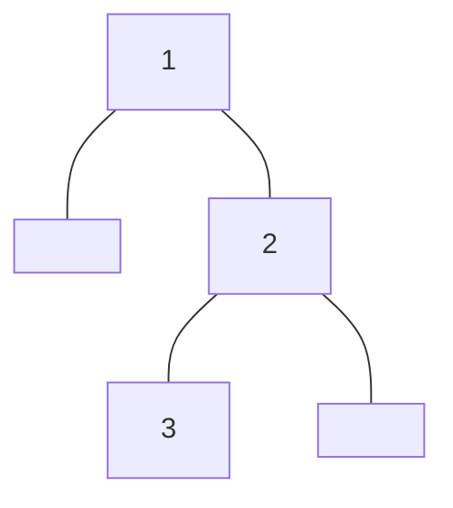

<!-- @import "_pre.css" -->

## 树

### 树的遍历

先序、中序略

<br>

#### 后序遍历

迭代写法:

思路：

初始化：栈 上次访问树结点指针 `prev` 当前树结点指针 `root`


1. `root` 入栈，若 `root` 有左孩子，则将左孩子加入栈中，并将 `root` 指向其左孩子 **(先左到底)**
2. 弹出栈顶结点并赋给 `root` ，若已访问其右孩子 *(root 无右孩子，或者 prev 指向 root 的右孩子时)*，访问 `root` ，并将 `prev` 设为 `root`， `root` 设为空 *(表示子树 root 已访问完毕)* **(出栈看右)**
3. 若未访问其右孩子，则 `root` 入栈，并将 `root` 设为 `root->right` **(复入寻右)**

循环 1. 2. 3. 直至栈空且 `root` 指向空

```cpp {cmd=run}
//sf
vector<int> postorderTraversal(TreeNode<int>* root) {
    vector<int> ans;
    if (root == nullptr)
        return ans;
    
    stack<TreeNode<int>*> stk;
    TreeNode<int>* prev = nullptr;
    while (root != nullptr || !stk.empty()) {
        while (root) {
            stk.push(root);
            root = root->left;
        }
        root = stk.top();
        stk.pop();
        if (!root->right || prev == root->right) {
            ans.push_back(root->val);
            prev = root;
            root = nullptr;
        } else {
            stk.push(root);
            root = root->right;
        }
    }
    return ans;
}
```
```cpp {cmd=run continue hide}
//entry
modify_source = true;
TreeNode<int>* t;
input >> t;
if (input)
    output << t->toMermaid() << endl << postorderTraversal(t);
//test
```
```cpp {cmd=run continue modify_source}
[1,null,2,3]
```

<!-- code_chunk_output -->

<div class=code-output> 



 [3,2,1]

<hr class=code-hr> average time: 0 ms


</div> 


<!-- /code_chunk_output -->

<br><hr class=short>

### 二叉树与递归

由于二叉树是递归定义的，所以很多二叉树的问题都能很方便地通过递归算法解决，例如树的遍历等等

我们知道递归解法中又存在着两种不同地递归方式：`自顶向下` 和 `自底向上`

`自顶向下`：先处理本层的数据，并将数据传递给下层，直到最底层 （先序遍历）
`自低向上`：上层的数据依赖于下层，需要让下层先处理，得到下层数据才能计算本层，然后返回给上层，最终到根节点（后序遍历）


<br>
<br>
<br>

---
