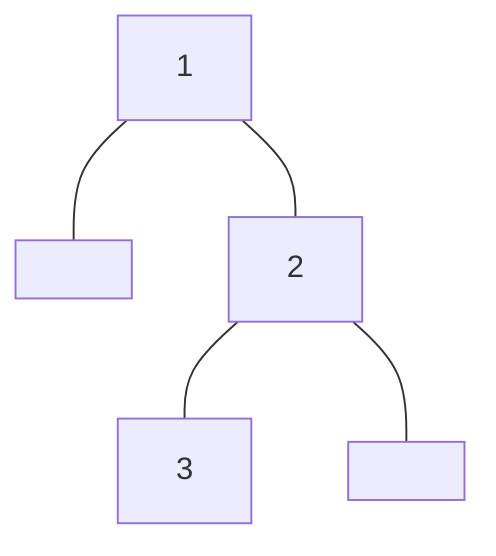

<!-- @import "_pre.css" -->

## 树

### 树的遍历

先序、中序略

#### 后序遍历

迭代写法:

```cpp {cmd=run}
//sf
vector<int> postorderTraversal(TreeNode<int>* root) {
    vector<int> ans;
    if (root == nullptr)
        return ans;
    
    stack<TreeNode<int>*> stk;
    TreeNode<int>* prev = nullptr;
    while (root != nullptr || !stk.empty()) {
        while (root != nullptr) {
            stk.push(root);
            root = root->left;
        }
        root = stk.top();
        stk.pop();
        if (root->right == nullptr || root->right == prev) {
            ans.push_back(root->val);
            prev = root;
            root = nullptr;
        } else {
            stk.push(root);
            root = root->right;
        }
    }
    return ans;
}
```
```cpp {cmd=run continue hide}
//entry
modify_source = true;
TreeNode<int>* t;
input >> t;
if (input)
    output << t->toMermaid() << endl << postorderTraversal(t);
//test
```
```cpp {cmd=run continue modify_source}
[1,null,2,3]
```

<!-- code_chunk_output -->

<div class=code-output> 



 [3,2,1]

<hr class=code-hr> average time: 0 ms


</div> 


<!-- /code_chunk_output -->

<br>
<br>
<br>

---
