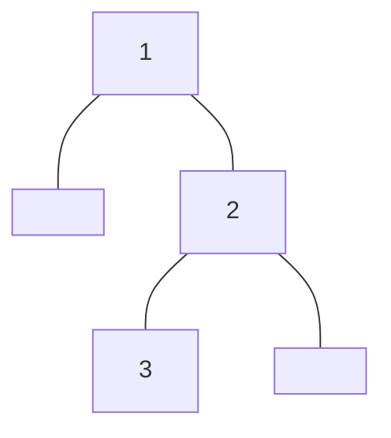
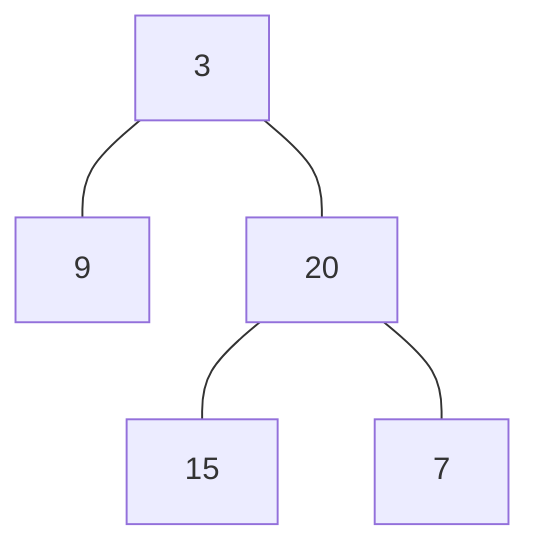

<!-- @import "/root.css" -->
## 树

### 二叉树的遍历

先序、中序略

<br>

#### 后序遍历

迭代写法:

思路：

初始化：栈 上次访问树结点指针 `prev` 当前树结点指针 `root`


1. `root` 入栈，若 `root` 有左孩子，则将左孩子加入栈中，并将 `root` 指向其左孩子 **(先左到底)**
2. 弹出栈顶结点并赋给 `root` ，若已访问其右孩子 *(root 无右孩子，或者 prev 指向 root 的右孩子时)*，访问 `root` ，并将 `prev` 设为 `root`， `root` 设为空 *(表示子树 root 已访问完毕)* **(出栈看右)**
3. 若未访问其右孩子，则 `root` 入栈，并将 `root` 设为 `root->right` **(复入寻右)**

循环 1. 2. 3. 直至栈空且 `root` 指向空

```cpp {cmd=run}
//sf
vector<int> postorderTraversal(TreeNode<int>* root) {
    vector<int> ans;
    if (root == nullptr)
        return ans;
    
    stack<TreeNode<int>*> stk;
    TreeNode<int>* prev = nullptr;
    while (root != nullptr || !stk.empty()) {
        while (root) {
            stk.push(root);
            root = root->left;
        }
        root = stk.top();
        stk.pop();
        if (!root->right || prev == root->right) {
            ans.push_back(root->val);
            prev = root;
            root = nullptr;
        } else {
            stk.push(root);
            root = root->right;
        }
    }
    return ans;
}
```
```cpp {cmd=run continue hide}
//entry
modify_source = true;
TreeNode<int>* t;
input >> t;
if (input)
    output << t->toMermaid() << endl << postorderTraversal(t);
//test
```
```cpp {cmd=run continue modify_source}
[1,null,2,3]
```

<!-- code_chunk_output -->

<div class=code-output> 



 [3,2,1]

<hr class=code-hr> average time: 0 ms


</div> 


<!-- /code_chunk_output -->

<br><hr class=short>

### 二叉树与递归

由于二叉树是递归定义的，所以很多二叉树的问题都能很方便地通过递归算法解决，例如树的遍历等等

我们知道递归解法中又存在着两种不同地递归方式：`自顶向下` 和 `自底向上`

`自顶向下`：先处理本层的数据，并将数据传递给下层，直到最底层 （先序遍历）
`自底向上`：上层的数据依赖于下层，需要让下层先处理，得到下层数据才能计算本层，然后返回给上层，最终到根节点（后序遍历）


<br>

#### 递归建树

##### 根据前序与中序遍历建树

输入：

    前序遍历序列 preorder
    中序遍历序列 inorder

输出：树

思路：

设 `preorder` 中第一个结点为 `first`，那么在 `inorder` 中， `first` 左边的结点都属于其左子树，右边的结点都属于其右子树

如此，构建结点 `first`，并将 `first` 在 `preorder` 中 **后移**，然后递归构建 `first` 的 **左子树和右子树**

:small_red_triangle:一定要先 **左子树**，因为 `first` 在 `preorder` 中后移，得到的新结点是其左子树根结点

代码：

```cpp {cmd=run}
//sf
class Solution {
    int preidx;
    unordered_map<int, int> index;
public:
    TreeNode<int>* buildTree(vector<int>& preorder, vector<int>& inorder) {
        for (int i = 0; i < inorder.size(); ++i) 
            index[inorder[i]] = i;
        preidx = 0;
        return build(0, inorder.size() - 1, inorder, preorder);
    }
    TreeNode<int>* build(int left, int right, vector<int>& inorder, vector<int>& preorder) {
        if (left > right)
            return nullptr;
        int rootval = preorder[preidx++];
        TreeNode<int> *root = new TreeNode<int>(rootval);
        root->left = build(left, index[rootval] - 1, inorder, preorder);
        root->right = build(index[rootval] + 1, right, inorder, preorder);
        return root;
    }
}so;
```
```cpp {cmd=run continue hide}
//entry
modify_source = true;
vector<int> inorder, preorder;
input >> preorder >> inorder;
if (input) {
    output << so.buildTree(preorder, inorder)->toMermaid();
}
//test
```
```cpp {cmd=run continue modify_source}
[3,9,20,15,7]
[9,3,15,20,7]
```

<!-- code_chunk_output -->

<div class=code-output> 




<hr class=code-hr> average time: 1 ms


</div> 


<!-- /code_chunk_output -->


<br>

##### 根据后序与中序遍历建树

与 [【根据前序与中序遍历建树】](#根据前序与中序遍历建树) 类似，但有细节需要注意

输入：

    后序遍历序列 postorder
    中序遍历序列 inorder

输出：树

思路：

设 `postorder` 中最后一个结点为 `last`，那么在 `inorder` 中， `last` 左边的结点都属于其左子树，右边的结点都属于其右子树

如此，构建结点 `last`，并将 `last` 在 `postorder` 中 **前移**，然后递归构建 `last` 的 **右子树和左子树**

:small_red_triangle:一定要先 **右子树**，因为 `last` 在 `postorder` 中前移，得到的新结点是其右子树根结点

代码：

```cpp {cmd=run}
//sf
class Solution {
    int postidx;
    unordered_map<int, int> index;
public:
    TreeNode<int>* buildTree(vector<int>& inorder, vector<int>& postorder) {
        for (int i = 0; i < inorder.size(); ++i) 
            index[inorder[i]] = i;
        postidx = postorder.size()-1;
        return build(0, inorder.size() - 1, inorder, postorder);
    }
    TreeNode<int>* build(int left, int right, vector<int>& inorder, vector<int>& postorder) {
        if (left > right)
            return nullptr;
        int rootval = postorder[postidx--];
        TreeNode<int> *root = new TreeNode<int>(rootval);
        root->right = build(index[rootval] + 1, right, inorder, postorder);
        root->left = build(left, index[rootval] - 1, inorder, postorder);
        return root;
    }
}so;
```
```cpp {cmd=run continue hide}
//entry
modify_source = true;
vector<int> inorder, postorder;
input >> inorder >> postorder;
if (input) {
    output << so.buildTree(inorder, postorder)->toMermaid();
}
//test
```
```cpp {cmd=run continue modify_source}
[9,3,15,20,7]
[9,15,7,20,3]
```

<!-- code_chunk_output -->

<div class=code-output> 


<hr class=code-hr> average time: 0 ms


</div> 


<!-- /code_chunk_output -->


<br><br><hr class=short>

### 力扣例题

<br>

树的遍历

- [x] [144. 二叉树的前序遍历](https://leetcode-cn.com/problems/binary-tree-preorder-traversal/)
- [x] [94. 二叉树的中序遍历](https://leetcode-cn.com/problems/binary-tree-inorder-traversal/)
- [x] [145. 二叉树的后序遍历](https://leetcode-cn.com/problems/binary-tree-postorder-traversal/)
- [x] [102. 二叉树的层序遍历](https://leetcode-cn.com/problems/binary-tree-level-order-traversal/)

树的递归算法

- [x] [104. 二叉树的最大深度](https://leetcode-cn.com/problems/maximum-depth-of-binary-tree/)
- [x] [101. 对称二叉树](https://leetcode-cn.com/problems/symmetric-tree/)
- [x] [112. 路径总和](https://leetcode-cn.com/problems/path-sum/)

树小结

- [x] [106. 从中序与后序遍历序列构造二叉树](https://leetcode-cn.com/problems/construct-binary-tree-from-inorder-and-postorder-traversal/)
- [x] [105. 从前序与中序遍历序列构造二叉树](https://leetcode-cn.com/problems/construct-binary-tree-from-preorder-and-inorder-traversal/)
- [x] [116. 填充每个节点的下一个右侧节点指针](https://leetcode-cn.com/problems/populating-next-right-pointers-in-each-node/)
- [x] [117. 填充每个节点的下一个右侧节点指针 II](https://leetcode-cn.com/problems/populating-next-right-pointers-in-each-node-ii/)
- [x] [236. 二叉树的最近公共祖先](https://leetcode-cn.com/problems/lowest-common-ancestor-of-a-binary-tree/)
- [x] [297. 二叉树的序列化与反序列化](https://leetcode-cn.com/problems/serialize-and-deserialize-binary-tree/)

<br>
<br>
<br>

---


