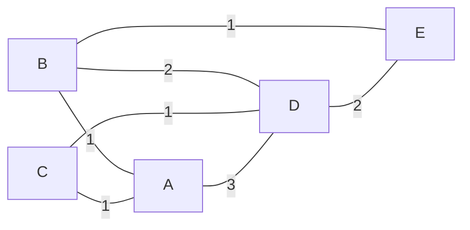
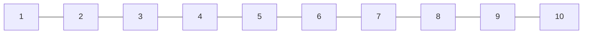

<!-- @import "/root.css" -->

## 自定义类解释


<br><hr class=short>

### Mermaid

本人为 mermaid 语法编写的类，用于实现数据结构的可视化

主要函数：
静态成员函数 `print(Type datastruct)` : 将数据结构转换为 mermaid 语法的字符串


目前支持的数据结构有：

* [*`std::vector<>`*](https://zh.cppreference.com/w/cpp/container/vector "可变长容器")
* [*`Graph<>`*](#graph "图")

<br>
<br>

示例1：

```cpp {cmd=run modify_source}
//sf
//entry
Graph<string, 0, 1, int> g(INT_MAX >> 1);
input >> g;
if (input) {
    output << Mermaid::print(g) << endl;
}
//test
[B,C,A,D,E]
[
    [0,0,1,2,1],
    [0,0,1,1,0],
    [1,1,0,3,0],
    [2,1,3,0,2],
    [1,0,0,2,0]
]
```

<!-- code_chunk_output -->




<hr class=code-hr> average time: 0 ms


<!-- /code_chunk_output -->


<br>
<br>
<br>

示例2：

```cpp {cmd=run modify_source}
vector<int> v{1,2,3,4,5,6,7,8,9,10};
cout << Mermaid::print(v);
```

<!-- code_chunk_output -->




<!-- /code_chunk_output -->


<br><hr class=short>

### Graph

图类

```cpp
template <
    class Type,
    bool direct = 0, 
    bool weight = 0,
    class CostType = int
> class Graph
```

`Type` : 点的名称的数据类型，如 *`string`*, *`int`* 等
`direct` : 为 0 时是无向图， 为 1 时是有向图
`weight` : 为 0 时是无权图， 为 1 时是有权图
`CostType` : 权值的数据类型，如 *`int`*, *`double`* 等

<br>

#### 成员字段

*`vector<Type>`*`vertex` :  点集
*`vector<vector<CostType>>`*`edge` : 邻接矩阵

#### 构造方法

`Graph`*`(CostType m = 0)`* : m 为标记两个顶点间无边连接的值

`Graph`*`(vector<Type> v, vector<vector<CostType>> e, CostType m = 0)`* : 点集和边集的构造函数

#### 成员方法

*`size_t`*`vSize()` : 返回点集的大小
*`size_t`*`eSize()` : 返回边集的大小

*`string`*`toMermaid()` : 返回 **`mermaid`** 语法的字符串

<br><hr class=short>

### Heap

堆（优先队列）

详见 [【堆】](#堆)

```cpp
template <
    class Type, 
    class Compare = std::less<Type> 
> class Heap
```

`Type` : 结点数据类型
`Compare` : 比较函数对象，用于维护堆的比较函数，当 `Compare(a, b)` 返回 *`true`* 时，`a` 更接近堆顶

#### 成员

`push(data)` : 将 `data` 插入堆中
`top()` : 返回堆顶元素，但不取出
`pop()` : 取出堆顶元素，但不返回


<br><hr class=short>

### UnionFind

并查集

未完待续。。。

<br><hr class=short>

### BinaryTree

二叉树

未完待续。。。

<br><hr class=short>

### BinarySearchTree

二叉搜索树

未完待续。。。

<br><hr class=short>

### LinkedList

单链表

未完待续。。。

<br><hr class=short>

### Hashset

哈希集合

未完待续。。。

<br><hr class=short>

### Hashmap

哈希映射

未完待续。。。


<br>
<br>
<br>

---
