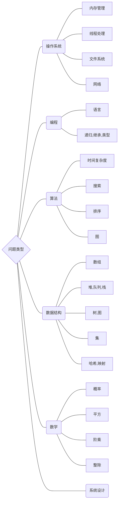
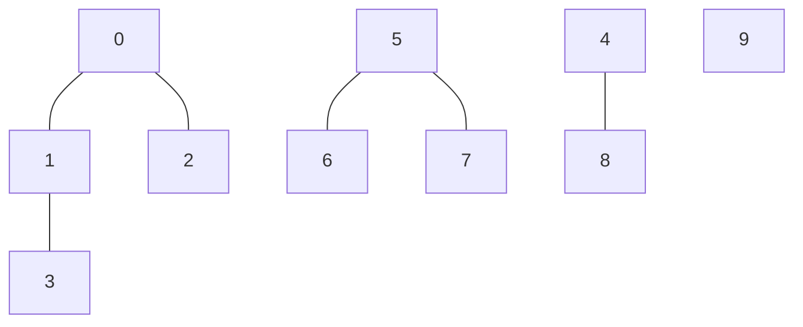
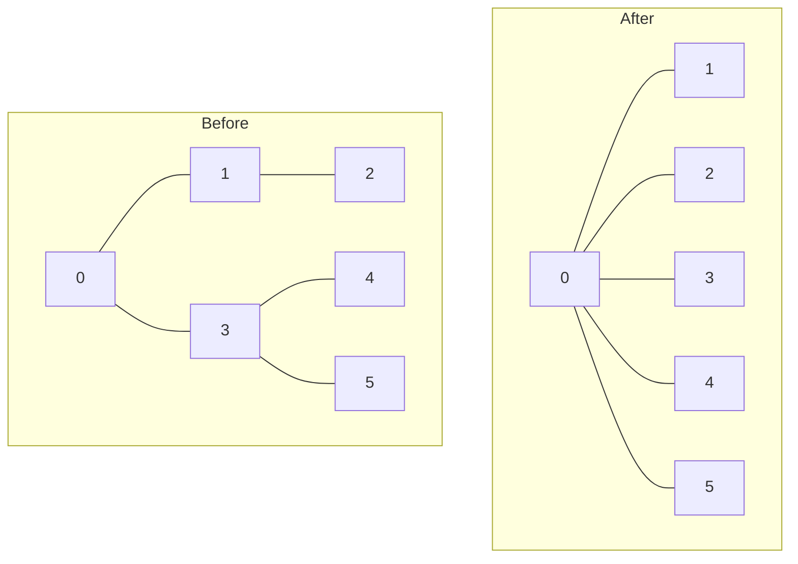
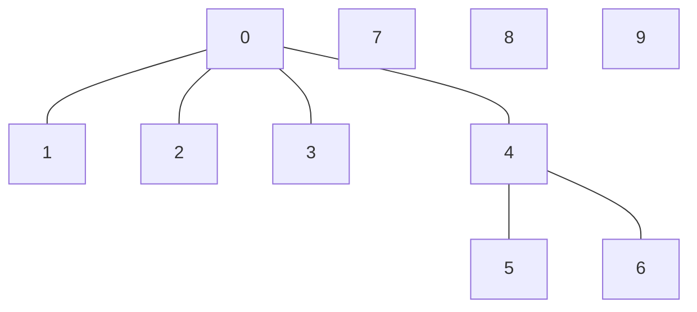

<head>
<style>
*{
    font-family:consolas;
}
html body h2{
    color:#a4f3d1;
    text-align:center;
}
html body h3{
    color:#e06666;
}
html body h4{
    color:pink;
}
html body h5{
    color:#e4e79b;
}
html body code {
    color: #83ee73;
}
.short {
    width:60%;
    background-color:rgba(0,0,0,0);
    border-bottom:4px dotted #515151;
}
.code-output {
    background-color: #323232;
    padding: .8em;
    margin: 1em 0px;
}
.code-hr {
    margin:3em 0px .5em 0px;
}
</style>
</head>


```cpp {cmd="run" id="sf" hide}
//sf
```

<font style="font-size:30px; font-weight:bold;">算法</font>


[TOC]

---

<br>

### 模板


```markdown

___
## 大分类
<hr class=short>

### 小分类（具体问题）

#### 方法或内容分类


分隔符：
大分类之间的间隔使用：

<br>

___

小分类之间分隔使用： 

<br>
<hr class=short>

最小的间隔：

<br>
<hr width=20%>

```

**示例：**

<div style="padding:2% 5% 2% 5%; background-color:#323232">


<!-- ********************************************************************************* -->
<!-- ********************************************************************************! -->
<!-- ********************************************************************************? -->
<!-- *****************************************************************************todo -->

---
## 三角形
<hr class=short>


### 三角形的周长

周长公式： $C = a + b + c$

<br><hr class=short>

### 三角形的面积

#### 公式1

$S=\frac{d \times h}{2} $

<br><br>

#### 公式2

$S=\sqrt{p(p-a)(p-b)(p-c)},~ p = \frac{a+b+c}{2}$

<br>
<br>
<br>


<!-- *****************************************************************************todo -->
<!-- ********************************************************************************? -->
<!-- ********************************************************************************! -->
<!-- ********************************************************************************* -->

---

</div>

<br>
<br>
<br>

---
## 一些笔记
<hr class=short>

### 面试问题

https://leetcode-cn.com/leetbook/read/top-interview-questions/xmted6/



<br><br><hr class=short>

### 算法与数据结构

https://leetcode-cn.com/leetbook/read/top-interview-questions/xmted6/

#### 算法

1. 排序算法：快排、归并、计数
2. 搜索算法：回溯、递归、剪枝技巧
3. 图论：最短路、最小生成树、网络流建模
4. 动态规划：背包问题、最长子序列、计数问题
5. 技巧：分治、倍增、二分、贪心

#### 数据结构

1. 数组与链表：单/双向链表、跳舞链
2. 栈与队列
3. 树与图：最近公共祖先、并查集
4. 哈希表
5. 堆：大/小根堆、可并堆
6. 字符串：字典树、后缀树

<br>
<br>
<br>

---

## 数论
算法中，数论常见的问题都是关于质数
<hr class=short>

### 质数

#### 质数的判断

对某个数 $n$ 是不是质数的判断：

遍历 $1 < x \le \sqrt{n}$ ， 若有 `n % x==0`，则不是质数

遍历前可先判断： $n$ 是不是 `大于 2 的偶数`

若满足此条件则必不为质数

<br>
<br>

#### 分解质因数

任何一个大于 1 的正整数 $n$，如果 $n$ 不是质数，那么 $n$ 可以唯一地分解成有限个质数的乘积

<br>
<br>

#### 最大公约数 gcd

求两数 $a,b$ 的最大公约数算法

##### 更相减损术

核心：`gcd(a, b) = gcd(b, a - b)`

```cpp {cmd=run continue=sf}
int gcd(int a, int b)
{
    if(a == b)  // 递归出口
        return a;
    if(a != b && a % 2 == 0 && b % 2 == 0)
    {
        // a b 都是偶数，用 2 约分
        while(a % 2 == 0) a /= 2;
        while(b % 2 == 0) b /= 2;
        return gcd(a, b);
    }
    if(a < b)
        return gcd(a, b - a);
    return gcd(b, a-b);
}
```
```cpp {cmd=run continue hide}
//entry
int a,b;
input >> a >> b;
if(input)
    output << gcd(a, b);
//test
```
```cpp {cmd=run continue}
63 98
260 104
```

<br>
<br>

##### 辗转相除法（欧几里得算法）

核心：`gcd(a, b) = gcd(b, a mod b)`

```cpp {cmd=run continue=sf}
int gcd(int a, int b)
{
    if(a < b)
        return gcd(b, a);
    if(a % b == 0)
        return b;
    return gcd(b, a % b);
}
```
```cpp {cmd=run continue hide}
//entry
int a,b;
input >> a >> b;
if(input)
    output << gcd(a, b);
//test
```
```cpp {cmd=run continue}
63 98
260 104
```

<br><br>

##### 裴蜀定理

表述：若 $\gcd (a, b) = c$, 那么对于任意整数对 $(x, y)$, $ax+by$ 一定是 $c$ 的倍数

特别的， 一定存在整数对 $x, y$, 使得 $ax+by=c$

推论：$a, b$ 互质 $\Leftrightarrow$ 存在整数对 $(x, y)$，使得 $ax+by=1$ 


<br>
<br>
<br>

---

## 数学几何

<br><hr class=short>

### 平面几何

#### 直线

##### 直线方程

一般式：$Ax+By+C=0$

斜截式：$y=kx+b$

截距式：$\frac{x}{a}+\frac{y}{b} = 1$

点斜式：$y-y_0=k(x-x_0)$

两点式：$\frac{x~-~x2}{x1-x2} = \frac{y~-~y2}{y1-y2}$

<br><br>

##### 点到直线的距离

点 $(x_0, y_0)$ 到直线 $Ax+By+C=0$ 的距离

公式： $d=\frac{|Ax_0+By_0+C|}{\sqrt{A^2+B^2}}$

<br><br>

#### 矩形

##### 矩形重叠问题

以 $[x1, y1, x2, y2]$ 的形式给出两个矩形 $rec1$, $rec2$ ，其中矩形的两边分别平行于 $x$ 轴和 $y$ 轴， $[x1, y1]$ 表示矩形左下角的点坐标， $[x2, y2]$ 表示矩形右上角坐标

问题：输入 $ax1, ay1, ax2, ay2, bx1, by1, bx2, by2$ ， 返回两个矩形是否重叠

思路：两个矩形重叠时，他们的 x 和 y 坐标范围有重叠

关键代码： 

```cpp 
ax1 < bx2 && bx1 < ax2 && ay1 < by2 && by1 < ay2
```

<br><br>

##### 矩形重叠面积

矩形表示方式同上

问题：输入 $ax1, ay1, ax2, ay2, bx1, by1, bx2, by2$ ， 返回两个矩形的重叠面积

关键代码：

```cpp
(min(ax2, bx2) - max(ax1, bx1)) * (min(ay2, by2) - max(ay1, by1))
```

<br><br>

#### 圆

##### 圆的方程

$(x-a)^2+(y-b)^2=r^2$

其中： 圆心坐标：$[a, b]$，半径：$r$


<br>
<br>
<br>

---
## 随机算法
<hr class=short>

### 权重随机算法

输入数组 `name` 和正整数数组 `w` ，其中每个元素 `w[i]` 表示选择到 `name[i]` 的权重，那么调用随机选择函数时，选择到 `i` 的概率为 $w[i]~/~sum(w)$

请你设计一个算法，实现这个随机选择函数

方法：前缀和 + 二分查找

思路：构造 `w` 数组的前缀和数组 `s`，随机生成一个索引 `x`，返回数组 `s` 中第一个大于等于 `x` 的元素的下标

表格解析：

|     w[i]     |   1   |   1   |   2   |   3   |
| :----------: | :---: | :---: | :---: | :---: |
|     s[i]     |   1   |   2   |   4   |   7   |
| 随机索引 `x` |   1   |   2   |  3 4  | 5 6 7 |

解释：如 x = 5,6,7 时，匹配到的是 w 中权重为 3 的下标，而且刚好 x 的取值有 3 个，满足的权重为 3 的要求


代码：
```cpp {cmd=run continue=sf}
class RandomSelect {
        vector<int> pre;
public:
    RandomSelect(vector<int>& w) {
        srand(time(0));
        pre.resize(w.size() + 1);
        pre[0] = 0;
        for (int i = 1; i < pre.size(); ++i) {
            pre[i] = pre[i - 1] + w[i - 1];
        }
    }
    
    int pickIndex() {
        int ran = rand() % pre[pre.size() - 1] + 1;
        int l = 1, r = pre.size() - 1, m = (l + r) / 2;
        int index = pre.size() - 1;
        while(l <= r) {
            if (pre[m] >= ran) {
                r = m - 1;
                index = m;
            } else {
                l = m + 1;
            }
            m = (l + r) / 2;
        }

        return index - 1;
    }
};
```
```cpp {cmd=run continue hide}
//entry
vector<int> w;
vector<string> name;
input >> w >> name;
if(input)
{
    RandomSelect rs(w);
    vector<vector<string>> res;
    for (int i = 0; i < 5; ++i) {
        vector<string> temp;
        for (int j = 0; j < 10; ++j) {
            temp.push_back(name[rs.pickIndex()]);
        }
        res.push_back(temp);
    }
    cout << res;
}
//test
```
```cpp {cmd=run continue}
//模拟一下某游戏抽卡
[40,50,8,2][白,紫,橙,彩]
```


<br>
<br>
<br>

---
## 位运算
<hr class=short>

### N进制转十进制

$720.5_{(8)} = \enspace ?$

$$
720.5_{(8)} = 7×8^{2}+2×8^{1}+0×8^{0}+5×8^{−1} = 464.625 
$$

<br><br>


### 十进制转N进制

#### 整数转换

$50_{(10)} = \enspace ? _{(2)}$

$$
\begin {gather*}
50 \div 2 = 25 &余& 0  \\
25 \div 2 = 12 &余& 1  \\
12 \div 2 = 6 &余& 0  \\
6 \div 2 = 3 &余& 0 \\
3 \div 2 = 1 &余& 1 \\
1 \div 2 = 0 &余& 1 
\end {gather*}
$$

余数反向遍历： 1 1 0 0 1 0， 因此 $50_{(10)} = 110010_{(2)}$

<br><br>

#### 小数转换

$0.6875_{(10)} = \enspace ? _{(2)}$

$$
\begin {gather*}
0.6875×2=1.375 &整数部分& 1 \\
0.375×2=0.75 &整数部分& 0\\
0.75×2=1.5 &整数部分& 1\\
0.5×2=1 &整数部分& 1\\
\end {gather*}
$$

整数部分正序遍历： 1 0 1 1，因此 $0.6875_{(10)} = 0.1011_{(2)}$

<br><hr class=short>

### 位运算的性质

幂等律： | &（幂等于它本身）
交换律： | & ^
结合律： | & ^

分配律： | 对 &，| 对 &，& 对 ^（类比 乘法对加法）
德摩根率： $\sim(a~\&~b) = ~\sim a~ | ~ \sim b, ~ ~ ~\sim(a~|~b) = ~\sim a~ \& ~ \sim b$
取反性质： $-1 =~ \sim 0,~ ~ ~-a = ~\sim (a-1)$

与运算性质： $a ~\&~ 0 = a,~ ~ ~a~\&~(-1)=a,~ ~ ~a~\&~(\sim a)=0$
或运算性质： $a~|~0=a,~ ~ ~a~|~(\sim a)=-1$
异或运算性质： $a ~\^{} ~ 0 = a,~ ~ ~a ~\^{} ~ (-1) = \sim a,~ ~ ~a~\^{}~a=0$

**其他性质：**

- $a ~\&~ (a−1)$ 可将 $a$ 的二进制表示中最后一个1 变成 0
- $a~\&~(-a)$ 结果为 只保留 $a$ 二进制中最后一个 1 ，其他全 0 （ $a ~\&~ (\sim(a-1))$ 等价）
- 让 $[a, b]$ 区间的所有数按位与，结果是如下形式的二进制字符串
  - 前面是：a 和 b 的公共前缀；后面补 0

<br><hr class=short>

### 格雷编码

> 格雷编码是一个二进制数字系统，在该系统中，两个连续的数值仅有一个位数的差异。
> 
> 给定一个代表编码总位数的非负整数 n，打印其格雷编码序列。即使有多个不同答案，你也只需要返回其中一种。
> 
> 格雷编码序列必须以 0 开头。

2位的格雷编码如：

<p align="center">00 - 0<br>01 - 1<br>11 - 3<br>10 - 2</p>

思路：
1. 初始数组为 [0]
1. 反向遍历 n（位数）次数组，在每个数组元素的最前面添加一个 1，并插入数组尾部

示例：

1. [ 0 ]
2. [ 0, <font color="red" >1</font> ]
3. [ 00, 01, <font color="red">11</font>, <font color="red">10</font> ]
4. [ 000, 001, 011, 010, <font color="red">110</font>, <font color="red">111</font>, <font color="red">101</font>, <font color="red">100</font> ] 

代码

```cpp {cmd="run" continue="sf"}
vector<int> grayCode(int n) {
    vector<int> ans;
    ans.push_back(0);
    for(int i = 0; i < n; ++i){
        for(int j = ans.size() - 1; j >= 0; --j){
            ans.push_back(ans[j] | 1 << i);
        }
    }
    return ans;
}
```
```cpp {cmd="run" continue hide}

};
Solution so;
//entry
int n;
input >> n;
if(n)
    cout<<so.grayCode(n);
//test
```
```cpp {cmd="run" continue}
3
4
5
```

<br><hr class=short>

### 状态压缩

状态压缩，顾名思义就是将多个值的状态压缩成一个数字。
具体而言，如果有 $n$ 个值，每个值有 2 种可能的状态，则状态总数有 $2^n$ 个，可以用一个 $n$ 位二进制数记录全部 $n$ 个状态的取值。


<br>
<br>
<br>

---
## 图
<hr class=short>

### 并查集

#### 一些定义：
父结点：顶点的直接父亲结点。（自己也可以是自己的父结点）
根结点：没有父节点的结点。（由于自己可以是自己的父结点，所以自己也可以是自己的根结点）

<br>

#### 并查集基本思想：
将一系列元素按照他们的关系合并到一系列集合中，并选取一个代表元素（父节点或根节点）。若查询两个元素间有无关系，则只需要返回他们各自的代表元素并比较，就能知道他们是否有关系（是否在同一个集合中）

<br>

#### 并查集编程思想：
例：

查询上图中 $(0, 3)$ $(1, 5)$ $(7,8)$ 的连通性

解法：

1. 生成并查集数组 $root[10]$
  初始化： `root[i] = i` 
  将 `root[i]` 设为 `i` 的父结点，无父结点就设为 `i` 本身

| 元素  |   0   |   0   |   0   |   1   |   4   |   5   |   5   |   5   |   4   |   9   |
| :---: | :---: | :---: | :---: | :---: | :---: | :---: | :---: | :---: | :---: | :---: |
| 下标  |   0   |   1   |   2   |   3   |   4   |   5   |   6   |   7   |   8   |   9   |

2. 查询 $0$ 和 $3$ 的根节点 （find 函数）
  `find(i)`: 
  - 当 `root[i] == i` 时，返回 `i` （ `i` 是根节点）
  - 当 `root[i] != i` 时，返回 `find(root[i])` （ `i` 不是根节点）

3. 若新增连接 $(4, 7)$ ，`root` 如何变化？ （union 函数）
  `union(i, j)`: `k = find(i); root[k] = j;`

<br>

#### 普通并查集两种实现方法

##### QuickFind 的并查集

`root` 数组存放每个结点的根结点
特点：

- `find` : $O(1)$ ，直接返回的就是根结点
- `union` : $O(n)$ ，需要将的其中一个的集合全部的根结点更新


实现：
```cpp {cmd=run}
//define
class UnionFind {
  vector<int> root;

public:
  UnionFind(int size){
      root.resize(size);
      for(int i = 0; i < root.size(); ++i)
          root[i] = i;
  }
  int find(int x){
      return root[x];
  }
  void union_(int x, int y){
      int rootY = find(y);
      if (find(x) != rootY)
          for(auto& i : root)
              if(i == rootY)
                  i = rootY;
  }
};
```

| QuickFind  | 构造函数 |  find  | union  |
| :--------: | :------: | :----: | :----: |
| 时间复杂度 |  $O(n)$  | $O(1)$ | $O(n)$ |

<br>

##### QuickUnion 的并查集

`root` 数组存放每个结点的父结点
特点：

- `find` : $O(h)$ ，$h$ 为并查集形成的树的高度，需要寻找才能返回根结点
- `union` : $O(1)$ ~ $O(n)$，时间复杂度取决于 `find` 函数 ，只需要将的其中一个结点的父结点更新


实现：

```cpp {cmd=run}
//define
class UnionFind {
    vector<int> root;

public:
    UnionFind(int size){
        root.resize(size);
        for(int i = 0; i < root.size(); ++i)
            root[i] = i;
    }
    int find(int x){
        while (x != root[x])
            x = root[x];
        return x;
    }
    void union_(int x, int y){
        int rootX = find(x);
        int rootY = find(y);
        if (rootX != rootY)
            root[rootY] = rootX;
    }
};
```

| QuickUnion | 构造函数 |  find  | union  |
| :--------: | :------: | :----: | :----: |
| 时间复杂度 |  $O(n)$  | $O(d)$ | $O(d)$ |

$d$ 为并查集中结点所在的树的平均深度

<br>

#### 按秩合并的 QuickUnion
`find` 函数不变
`union` 函数：低树往高树合并（谁高谁做根结点）

实现：

```cpp {cmd=run}
//define
class UnionFind{
    vector<int> root;
    vector<int> rank;   // rank 数组储存每个结点所在的高度

public:
    UnionFind(int size) {
        root.resize(size);
        rank.resize(size);
        for(int i = 0; i < root.size(); ++i) {
            root[i] = i;
            rank[i] = 1;
        }
    }
    int find(int x) {
        while (x != root[x])
            x = root[x];
        return x;
    }
    void union_(int x, int y) {
        int rootX = find(x);
        int rootY = find(y);
        if (rootX != rootY) {
            if (rank[rootX] > rank[rootY]) {
                root[rootY] = rootX;
            } else if (rank[rootX] < rank[rootY]) {
                root[rootX] = rootY;
            } else {
                root[rootY] = rootX;
                rank[rootX] += 1;
            }
        }
    }
};
```

| 按秩合并的QuickUnion | 构造函数 |    find     |    union    |
| :------------------: | :------: | :---------: | :---------: |
|      时间复杂度      |  $O(n)$  | $O(\log n)$ | $O(\log n)$ |

<br>

#### 路径压缩的 QuickUnion
调用 `find` 函数后，将该查找路径上的所有结点的父结点，都改为根结点

路径压缩本质是 执行 `find()` 的过程将下图左图，转化为右图



实现：
```cpp {cmd=run}
//define
class UnionFind {
    vector<int> root;

public:
    UnionFind(int size) {
        root.resize(size);
        for(int i = 0; i < root.size(); ++i)
            root[i] = i;
    }
    int find(int x) {
        if (x == root[x])
            return x;
        return root[x] = find(root[x]);
    }
    void union_(int x, int y) {
        int rootX = find(x);
        int rootY = find(y);
        if (rootX != rootY)
            root[rootY] = rootX;
    }
};
```

| 路径压缩的QuickUnion | 构造函数 |    find     |    union    |
| :------------------: | :------: | :---------: | :---------: |
|      时间复杂度      |  $O(n)$  | $O(\log n)$ | $O(\log n)$ |

<br>

#### 基于路径压缩的按秩合并优化的并查集

`find()` 路径优化
`union()` 按秩合并

实现：
```cpp {cmd=run}
//define
class UnionFind {
public:
    vector<int> root;
    vector<int> rank;

    UnionFind(int size) {
        root.resize(size);
        rank.resize(size);
        for(int i = 0; i < root.size(); ++i){
            root[i] = i;
            rank[i] = 1;
        }
    }
    int find(int x) {
        if (x == root[x])
            return x;
        return root[x] = find(root[x]);
    }
    void union_(int x, int y) {
        int rootX = find(x);
        int rootY = find(y);
        if (rootX != rootY) {
            if (rank[rootX] > rank[rootY]) {
                root[rootY] = rootX;
            } else if (rank[rootX] < rank[rootY]) {
                root[rootX] = rootY;
            } else {
                root[rootY] = rootX;
                rank[rootX] += 1;
            }
        }
    }
};
```

```cpp {cmd=run continue modify_source}
//use
UnionFind uf(10);
uf.union_(0,1);
uf.union_(0,2);
uf.union_(1,3);

uf.union_(4,5);
uf.union_(5,6);

uf.union_(2,4);


// output
begin_out(cout) << "```mermaid \n" << "graph TD; \n";
for (int i = 0; i < uf.root.size(); ++i) {
    if(uf.root[i] != i)
        cout << uf.root[i] << " --- " << i << endl;
    else
        cout << i << endl;
}
cout << "``` \n";
end_out(cout);
```

<!-- code_chunk_output -->

<div class=code-output> 


</div> 


<!-- /code_chunk_output -->


<br><br><hr class=short>

### 深度优先搜索

方法：使用栈

输入：

    一维数组 V ，V[i] 表示顶点 i
    二维数组 E ，E[i][j] 表示点 i 和点 j 之间是否相连（或相连的权值）

输出：深度优先搜索遍历序列

代码

```cpp {cmd=run continue=sf}
string DepthFirstSearch(vector<string>& V, vector<vector<int>>& E) {
    vector<bool> visit(V.size(), false);
    stack<int> S;
    stringstream res("");
    S.push(0);
    while (!S.empty()) {
        int i = S.top();
        S.pop();
        if(visit[i]) continue;
        res << V[i] <<' ';
        visit[i] = true;
        for (int j = 0; j < E[i].size(); ++j) {
            if (E[i][j]) {
                S.push(j);
            }
        }
    }
    return res.str();
}
```
```cpp {cmd=run continue hide}
//entry
vector<string> V;
vector<vector<int>> E; 

input >> V >> E;
if(input){
    output << DepthFirstSearch(V, E);
}
//test
```
```cpp {cmd=run continue}
[A,B,C,D,E,F]
[
    [1,1,1,1,0,0],
    [1,1,0,0,1,1],
    [1,0,1,0,1,0],
    [1,0,0,1,1,0],
    [0,1,1,1,1,1],
    [0,1,0,0,1,1]
]
```

<br><br><hr class=short>

### 广度优先搜索

方法：使用队列（跟dfs代码几乎一样，就是栈换成了队列）

输入：

    一维数组 V ，V[i] 表示顶点 i
    二维数组 E ，E[i][j] 表示点 i 和点 j 之间是否相连（或相连的权值）

输出：广度优先搜索遍历序列

代码

```cpp {cmd=run continue=sf}
string BreathFirstSearch(vector<string>& V, vector<vector<int>>& E) {
    vector<bool> visit(V.size(), false);
    queue<int> Q;
    stringstream res("");
    Q.push(0);
    while (!Q.empty()) {
        int i = Q.front();
        Q.pop();
        if(visit[i]) continue;
        res << V[i] <<' ';
        visit[i] = true;
        for (int j = 0; j < E[i].size(); ++j) {
            if (E[i][j]) {
                Q.push(j);
            }
        }
    }
    return res.str();
}
```
```cpp {cmd=run continue hide}
//entry
vector<string> V;
vector<vector<int>> E; 

input >> V >> E;
if(input){
    output << BreathFirstSearch(V, E);
}
//test
```
```cpp {cmd=run continue}
[A,B,C,D,E,F]
[
    [1,1,1,1,0,0],
    [1,1,0,0,1,1],
    [1,0,1,0,1,0],
    [1,0,0,1,1,0],
    [0,1,1,1,1,1],
    [0,1,0,0,1,1]
]
```

<br><br><hr class=short>

### 所有路径

求图中两点的所有路径，且每个结点只能经过一次

输入：

    一维数组 V，V[i] 表示顶点 i
    二维数组 E，E[i][j] 表示点 i 和点 j 之间是否相连（或相连的权值）
    顶点 a, b

输出：

    数组 O，存放了 a->b 的所有路径

代码

深度优先搜索所有路径

```cpp {cmd=run continue=sf}
vector<vector<string>> dfsPath(vector<string>& V, vector<vector<int>>& E, int a, int b) {
    vector<bool> visit(V.size(), false);
    stack<vector<int>> S;
    vector<vector<string>> res;
    vector<int> start{a};
    S.push(start);

    while (!S.empty()) {
        vector<int> cur = S.top();
        S.pop();
        int i = cur.back();

        /* 判断是否到达终点 */
        if (i == b) {
            vector<string> temp;
            for(int j = 0; j < cur.size(); ++j) {
                temp.push_back(V[cur[j]]);
            }
            res.push_back(temp);
            continue;
        }

        /* 获取下一结点，并将路径入栈 */
        for(int j = 0; j < E[i].size(); ++j) {
            if(E[i][j] && i != j) {

                /* 判断是否已访问 */
                bool visit = false;
                for(int k = 0; k < cur.size(); ++k) {
                    if(j == cur[k])
                        visit = true;
                }
                if(visit) continue;

                /* 结点 j 加入路径 */
                vector<int> temp = cur;
                temp.push_back(j);
                S.push(temp);
            }
        }
    }

    return res;
}
```
```cpp {cmd=run continue hide}
//entry
vector<string> V;
vector<vector<int>> E; 
int a, b;

input >> V >> E >> a >> b;
if(input){
    output << dfsPath(V, E, a, b);
}
//test
```
```cpp {cmd=run continue}
[A,B,C,D,E,F]
[
    [1,1,1,1,0,0],
    [1,1,0,0,1,1],
    [1,0,1,0,1,0],
    [1,0,0,1,1,0],
    [0,1,1,1,1,1],
    [0,1,0,0,1,1]
]
0 1
```

<br><br>

广度优先搜索所有路径

```cpp {cmd=run continue=sf}
vector<vector<string>> dfsPath(vector<string>& V, vector<vector<int>>& E, int a, int b) {
    vector<bool> visit(V.size(), false);
    queue<vector<int>> S;
    vector<vector<string>> res;
    vector<int> start{a};
    S.push(start);

    while (!S.empty()) {
        vector<int> cur = S.front();
        S.pop();
        int i = cur.back();

        /* 判断是否到达终点 */
        if (i == b) {
            vector<string> temp;
            for(int j = 0; j < cur.size(); ++j) {
                temp.push_back(V[cur[j]]);
            }
            res.push_back(temp);
            continue;
        }

        /* 获取下一结点，并将路径入栈 */
        for(int j = 0; j < E[i].size(); ++j) {
            if(E[i][j] && i != j) {

                /* 判断是否已访问 */
                bool visit = false;
                for(int k = 0; k < cur.size(); ++k) {
                    if(j == cur[k])
                        visit = true;
                }
                if(visit) continue;

                /* 结点 j 加入路径 */
                vector<int> temp = cur;
                temp.push_back(j);
                S.push(temp);
            }
        }
    }

    return res;
}
```
```cpp {cmd=run continue hide}
//entry
vector<string> V;
vector<vector<int>> E; 
int a, b;

input >> V >> E >> a >> b;
if(input){
    output << dfsPath(V, E, a, b);
}
//test
```
```cpp {cmd=run continue}
[A,B,C,D,E,F]
[
    [1,1,1,1,0,0],
    [1,1,0,0,1,1],
    [1,0,1,0,1,0],
    [1,0,0,1,1,0],
    [0,1,1,1,1,1],
    [0,1,0,0,1,1]
]
0 1
```

<br><br><hr class=short>

### 最短路径

#### Floyd 算法

方法：动态规划

适用范围：任何图，但最短路必须存在（不能有负环）

实现：
1. 使用一个数组 `f[k][x][y]` 表示 仅通过结点 1 到 $k$，结点 $x$ 到结点 $y$ 的最短路径长度
2. 初始化base case `f[0][x][y]` 有以下取值：
   1. 当 x 直接与 y 相连时，x 与 y 的边权；
   2. 当 x 与 y 不直接相连时， $+\infty$ ;
   3. 当 x = y 时，0
3. 状态转移方程：`f[k][x][y] = min(f[k][x][y], f[k-1][x][k] + f[k-1][k][y])`

     ```cpp
     for(int k = 1; k < n; ++k){
         for(int x = 1; x < n; ++x){
             for(int y = 1; y < n; ++y){
                 f[k][x][y] = min(f[k][x][y], f[k-1][x][k] + f[k-1][k][y]);
             }
         }
     }
     ```

4. 优化：数组下标 k 对结果无影响，即将状态转移方程改为：`f[x][y] = min(f[x][y], f[x][k] + f[k][y])`

    ```cpp
    for(int k = 1; k < n; ++k){
         for(int x = 1; x < n; ++x){
             for(int y = 1; y < n; ++y){
                 f[x][y] = min(f[x][y], f[x][k] + f[k][y]);
             }
         }
     }
    ```

时间复杂度：$O(n^3)$
空间复杂度：$O(n^2)$

<br><br>

#### Bellman-Ford 算法

方法：基于松弛（relax）操作

适用范围：支持负权

实现：
1. 假设起始结点为 $S$，任意结点 $u$，定义 `dist[u]` 为 $S$ 到 $u$ 的最短路径长度；
   定义松弛操作 `relax(u, v): dist[v] = min(dist[v], dist[u] + edge_len[u,v])`
2. 初始化：`dist[u] = edge_len(S, u)`
3. 


<br><br><br>
---
## 数组
<hr class=short>

### Boyer-Moore 投票算法

适用情况：找出数组中的众数，众数个数大于 $\lfloor n/2 \rfloor$

思路：删除一对不相同的元素，不会影响最终结果，删除到最后剩下的一定是众数（因为思路是两两抵消，所以众数个数一定要多于数组的一半，否则获得的答案可能错误）

实现：

1. 维护一个候选众数 `candidate` 和它出现的次数 count
   
2. 初始化：count = 0
   
3. 遍历数组元素 `x` ：
   - 当 `count == 0` 时，令 `candidate = x`
   - 当 `x == candidate` 时，`++count`
   - 当 `x != candidate` 时，`--count`

4. 遍历结束后，`candidate` 即是整个数组的众数

代码：

```cpp{cmd=run continue=sf}
int majorityElement(vector<int>& nums) {
    int ans, count = 0;
    for(int i = 0; i < nums.size(); ++i){
        if(count == 0)
            ans = nums[i];
        if(ans == nums[i])
            ++count;
        else
            --count;
    }
    return ans;
}
```
```cpp{cmd=run continue hide}
//entry
vector<int> v;
input >> v;
if(input)
    cout << majorityElement(v);
//test
```
```cpp{cmd=run continue}
[1,1,1,1,2,2]
[2,2,1,1,1,2,2]
[3,2,3]
[1,1,1,2,2,3,4,5] //这个不行
```

<hr class=short>

### 前缀和与差分

#### 前缀和

前缀和即数组的前 `n` 项和

如 （建议前缀和数组下标从 1 开始，可以免除一些麻烦）
`s[0] = 0`
`s[1] = a[0]`
`s[2] = a[0] + a[1]`
...

<br>

#### 差分

差分与前缀和互为逆运算，即为通过前缀和数组 `s` 求原数组

方法： `a[i] = s[i] - s[i-1]`

<br><hr class=short>

#### 一维数组前缀和

适用范围：求数组区间 (l, r) 的和

方法：构造前缀和数组 s ，`s[r] - s[l]` 即为所求区间和（差分）

（求 a[0] 时为 s[1] - s[0] = a[0] - 0，这就是下标从 1 开始的好处，统一了差分的形式）

代码：迭代构造前缀和
```cpp {cmd=run continue=sf}
vector<int> prefix_sum(vector<int>& v) {
    vector<int> res(v.size() + 1);
    res[0] = 0;
    for (int i = 1; i < res.size(); ++i) {
        res[i] = res[i - 1] + v[i - 1];
    }
    return res;
}
```
```cpp {cmd=run continue hide}
//entry
vector<int> v;
input >> v;
if(input)
    cout << prefix_sum(v);
//test
```
```cpp {cmd=run continue}
[1,2,3,4,5,6]
```

<br><hr class=short>

#### 数组区间增量

> **leetcode 1109. 航班预订统计**
> 这里有 n 个航班，它们分别从 1 到 n 进行编号。
>
> 有一份航班预订表 bookings ，表中第 i 条预订记录 bookings[i] = [firsti, lasti, seatsi] 意味着在从 firsti 到 lasti （包含 firsti 和 lasti ）的 每个航班 上预订了 seatsi 个座位。
> 
> 请你返回一个长度为 n 的数组 answer，其中 answer[i] 是航班 i 上预订的座位总数。
> 
>  
> 
> > 示例 1：
> > 输入：bookings = [ [1,2,10],[2,3,20],[2,5,25] ], n = 5
> > 输出：[10,55,45,25,25]
> > 解释：
> > |  航班编号  |   1   |   2   |   3   |   4   |   5   |
> > | :--------: | :---: | :---: | :---: | :---: | :---: |
> > | 预订记录 1 |  10   |  10   |   >   |       |       |
> > | 预订记录 2 |  [ ]()    |  20   |  20   |   >   |       |
> > | 预订记录 3 |  [ ]()    |  25   |  25   |  25   |  25   |
> > |  总座位数  |  10   |  55   |  45   |  25   |  25   |
> > 因此，answer = [10,55,45,25,25]
>

- 每个预定记录数组都可以看成是 `answer` 数组的一个区间增量

    bookings[0] = [1,2,10] 表示 answer 数组区间 [1,2] 增加 10
    bookings[1] = [2,3,20] 表示 answer 数组区间 [2,3] 增加 20
    bookings[2] = [2,5,25] 表示 answer 数组区间 [2,5] 增加 25

    <br>


- 将 `bookings` 转换为数组 `b`

    b[0] = [10,10,0,0,0]
    b[1] = [0,20,20,0,0]
    b[2] = [0,25,25,25,25]

    <br>

    `answer[i] = b[0][i] + b[1][i] + b[2][i]`

    <br>

    到这里暴力法应该很容易想到了

    <br>

- 对数组 `b` 进行差分（前缀和的逆运算）得到数组 `d`

    d[0] = [10,0,-10,0,0]
    d[1] = [0,20,0,-20,0]
    d[2] = [0,25,0,0,0]

    <br>

    差分数组求和后 dsum = [10,45,-10,-20,0]
    对 dsum 求前缀和得 answer = [10,55,45,25,25]

    <br>

    此处观察可知，题目 `bookings[0]` 数组给出了 区间 [1,2] = 10 ，
    可转换为 `d[0]` 中的 d[0][1] = 10, d[0][3] = -10

    因此 区间 (l,r) 的增量 x ，可以转换为 差分数组中的 d[l] = x, d[r+1] = -x

    <br>


    由此题可知 对数组集合 `s` （或多个数组）
    数组的求和 = 对每个数组差分后求和，再求前缀和

    <br>

    即
    $\sum{s} = P(\sum{D(s)})$
    P() 为求前缀和
    D() 为求差分

<br>
<br>
<br>

---
