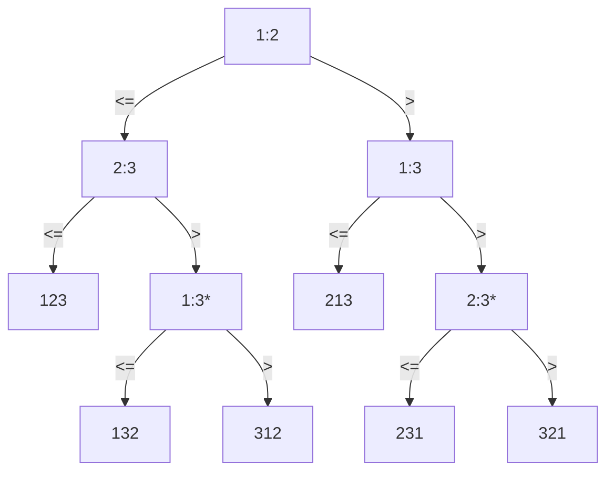

[TOC]

##### what is important in programming

> performance 性能
>
> cost 成本
>
> correctness 正确性
>
> simplicity 简洁
>
> maintainability 可维护性
>
> stability/robustness 稳定性/健壮性
>
> features/functionality 特性/功能性
>
> modularity 模块化
>
> security 安全
>
> scalability 可扩展性
>
> user-friendliness 用户友好


##### T(n)

- ignore machine-dependent constants
- look at the growth of T(n) as n->∞

 

##### 主定理练习

1. $T(n)=4T(n/2)+n $

   $f(n)=n < n^{log_ba}=n^{log_24}=n^2$

   $T(n)=n^2$

2. $T=4T(n/2)+n^2$

   $f(n)=n^2 = n^{log_ba}=n^{log_24}=n^2$

   $T(n)=n^2logn$

 

##### 斐波那契定理

$\begin{bmatrix}F_{n-1}&F_n\\F_n&F_{n-1}\end{bmatrix}=\begin{bmatrix}1&1\\1&0\end{bmatrix}^n$


##### Decision-tree

sort <$a_1, a_2, a_3$>

1:2 means 1<2



基于比较的排序，大部分都能画出对应的决策树，决策树的高度表示了比较次数，且高度最小为 $nlogn$ ，所以，基于比较的排序算法最优效率为 $\Theta(nlogn)$


##### Counting-Sort

基于计数的排序

方法：前缀和

稳定排序：是

```C++
for i = 1 to k    // k >= max(A[j])
    C[i] = 0
for j = 1 to n
    C[A[j]] ++
// C[i] contains the number of elements equal to i
for i = 2 to k
    C[i] = C[i] + C[i - 1]
// C[i] contains the number of elements less than or equal to i: 统计前缀和
for j = n downto 1
    B[C[A[j]]] = A[j]
    C[A[j]] = C[A[j]] - 1
```

时间复杂度：$O(k + n)$
空间复杂度：$O(k)$

##### Radix Sort

基数排序


示例：

```
329               	720                 720               329
457                 355                 329               355
657                 436                 436               436
839        ->       457        ->       839      ->       457
436  按最后一位排序	657   按倒数第二位	355  按倒数第三位  657  
720  相同要保持顺序	329              	457               720
355                 839                 657               839
```

分析

* 在每一个位比较时，使用计数排序 --- $O(k+n)$
* n 个整数，每一个有 b bit 长（取值：$0 \sim 2^b-1$)
* 将 整数分成 b/r 位，则每个整数有 r 位长（即 化为 $2^r$ 进制，那么计数排序中的 $k = 2^r$）
* 综上，时间复杂度： $O(\frac{b}{r}\cdot (n+2^r))$
* 对 r 求导，可以得出 当 $r=\lg{n}$ 时，有 $O(\frac{bn}{\lg{n}})$


##### order statistics

给n个数，找第k小

方法1

排序，返回 A[k] 

方法2：分治法


Rand-Select(A, p, q, i)  // 找 A[p~q] 的第 i 小
```cpp

```
