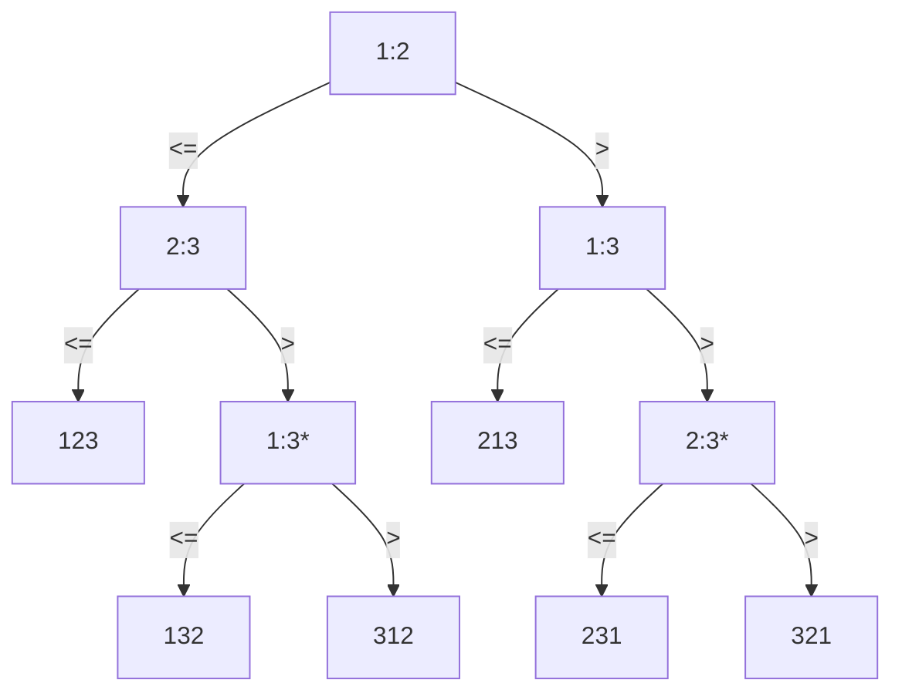

[TOC]

<br>
##### what is important in programming

> performance 性能
>
> cost 成本
>
> correctness 正确性
>
> simplicity 简洁
>
> maintainability 可维护性
>
> stability/robustness 稳定性/健壮性
>
> features/functionality 特性/功能性
>
> modularity 模块化
>
> security 安全
>
> scalability 可扩展性
>
> user-friendliness 用户友好


<br>
##### T(n)

- ignore machine-dependent constants
- look at the growth of T(n) as n->∞

 

<br>
##### 主定理练习

1. $T(n)=4T(n/2)+n $

   $f(n)=n < n^{log_ba}=n^{log_24}=n^2$

   $T(n)=n^2$

2. $T=4T(n/2)+n^2$

   $f(n)=n^2 = n^{log_ba}=n^{log_24}=n^2$

   $T(n)=n^2logn$

 

<br>
##### 斐波那契定理

$\begin{bmatrix}F_{n-1}&F_n\\F_n&F_{n-1}\end{bmatrix}=\begin{bmatrix}1&1\\1&0\end{bmatrix}^n$


<br>
##### Decision-tree

sort <$a_1, a_2, a_3$>

1:2 means 1<2



基于比较的排序，大部分都能画出对应的决策树，决策树的高度表示了比较次数，且高度最小为 $nlogn$ ，所以，基于比较的排序算法最优效率为 $\Theta(nlogn)$


<br>
##### Counting-Sort

基于计数的排序

方法：前缀和

稳定排序：是

```C++
for i = 1 to k    // k >= max(A[j])
    C[i] = 0
for j = 1 to n
    C[A[j]] ++
// C[i] contains the number of elements equal to i
for i = 2 to k
    C[i] = C[i] + C[i - 1]
// C[i] contains the number of elements less than or equal to i: 统计前缀和
for j = n downto 1
    B[C[A[j]]] = A[j]
    C[A[j]] = C[A[j]] - 1
```

时间复杂度：$O(k + n)$
空间复杂度：$O(k)$

<br>
##### Radix Sort

基数排序


示例：

```
329               	720                 720               329
457                 355                 329               355
657                 436                 436               436
839        ->       457        ->       839      ->       457
436  按最后一位排序	657   按倒数第二位	355  按倒数第三位  657  
720  相同要保持顺序	329              	457               720
355                 839                 657               839
```

分析

* 在每一个位比较时，使用计数排序 --- $O(k+n)$
* n 个整数，每一个有 b bit 长（取值：$0 \sim 2^b-1$)
* 将 整数分成 b/r 位，则每个整数有 r 位长（即 化为 $2^r$ 进制，那么计数排序中的 $k = 2^r$）
* 综上，时间复杂度： $O(\frac{b}{r}\cdot (n+2^r))$
* 对 r 求导，可以得出 当 $r=\lg{n}$ 时，有 $O(\frac{bn}{\lg{n}})$


<br>
##### order statistics

给n个数 A[1...n]，找第k小

<br>

**方法1**

升序排序，返回 A[k] 

**方法2：分治法**

Rand-Select(A, p, q, i)  // 找 A[p~q] 的第 i 小
```cpp
if p = q
	return A[p]
r = Rand-Partition(A, p, q)
// Rand-Partition 参考快排，随机选取一个数，并将该数放在 A[p...q] 的某个位置 r ，使得 A[p...r-1] < A[r] < A[r+1...q]，并返回下标 r 
if i = r
	return A[r]
else if i < r
	return Rand-Select(A, p, r - 1, i)
else
	return Rand-Select(A, r + 1, q, i) 
```

时间复杂度：$O(n)$
最坏情况：$O(n^2)$ --- 数组已排序

**例子： i = 7**
$A = [6, 10, 13, 5, 8, 3, 2, 11]$

选取 6 作为划分元素，调用划分函数 `Partition(A, 0, A.size()-1)`
得到 $A'=[2,5,3,6,8,13,10,11]$，其中 `r->6, r=4`
此时即使再排序，6 的位置依然不变，结合方法一排序后的答案，我们知道 6 即是第 4 小（下标从1开始)的数
然后判断大小递归即可

<br>

##### 哈希表

表中存放了元素，每个元素通过 key 值索引

**operations**

- Insert(S, x)
- Delete(S, x)
- Search(S, k)

<br>

**Direct access table**

建立数组 T[0...m-1]

每个元素有一个独立的 key

<br>

**hashing**

有一个表存放数据，每一个数据称为 slot

哈希函数 h 生成 value 的 key

通过访问 key 对应的 slot

<br>

问题1：同样的 value 生成同样的 key，那么当有两个相同的元素时，会发生碰撞（散列冲突）

方法一：拉链法

| record |       |       |       |       |       |       |
| :----: | :---: | :---: | :---: | :---: | :---: | :---: |
|        |
|   i    |
|   ^    |   →   |  46   |   →   |  56   |   →   |  52   |
|        |
|        |
|        |

<br>

方法二：开放寻址法

哈希函数 h(key, times)

先用哈希函数探测一次，如果该位置满了，则用第二个哈希函数勘探第二次，如此循环，直至到达一个空位置

1. 线性勘探法
	$h(k, i) = (h(k,0) + i) \mod m$
	每一次勘探都是直接寻找连续的下一个位置

2. 二次哈希
	$h(k,i) = (h_1(k) + i*h_2(k)) \mod m$
	通常 选择 $m=2^r$ 和 奇数的 $h_2(k)$

<br>

问题2：如何选择哈希函数 h， 使得对于任意元素，生成任意 key 的概率是均匀的

方法一：除法哈希法

$h(k) = k \mod m$

优点：简单
缺点：除法运算慢

<br>

方法二：乘法哈希法

槽的数量 $m=2^r$

计算机字长为 $w$ bit

$h(k)=(A*k \mod 2^w) >> (w-r)$ ，其中， $A$ 是奇数，且 $2^{w-1} < A < 2^w $

优点：快

<br>

方法三：随机选择哈希函数

全域哈希

选择质数 $m$ 
将键 $k$ 看成 $m$ 进制，得到 $k=<k_0,k_1,...,k_r>,(0\le k_r \le m-1)$
随机选择一个数 $a=<a_0,a_1,...,a_r>$ 用于表示哈希函数 $(0\le a_r \le m-1)$
定义 $h_a(k)=(\sum ^r_{i=0} a_ik_i)\mod m$

完全哈希

构建一个**静态**哈希表，大小 $m=O(n)$ ，保证最坏查找效率为 $O(1)$

方法：使用二次哈希，第一次哈希定位到表中，然后读取第二次哈希函数，并通过二次哈希表指针和二次哈希函数，定位到最终位置

|       | record |       |       |       |       |       |       |       |       |       |       |
| :---: | :----: | :---: | :---: | :---: | :---: | :---: | :---: | :---: | :---: | :---: | :---: |
|   0   |   /    |
|   1   |   4    |  31   |
|   ^   |   ^    |   ^   |   →   |   /   |  14   |  27   |   /   |
|  ...  |
|   6   |   9    |  96   |
|   ^   |   ^    |   ^   |   →   |   /   |  40   |  37   |   /   |   /   |   /   |   /   |  22   |
|  ...  |
| m - 1 |   /    |

上图中 `record` 的第一个数，如 4，9 表示二次哈希表中的长度，第二个数 31，96 表示二次哈希函数的因子

$
h(14)=h(27)=1 \\
h_{31}(14)=1, h_{31}(27)=2 \\
h(40)=h(37)=h(22)=6 \\
h_{96}(40)=1, h_{96}(37)=2, h_{96}(22)=7
$
