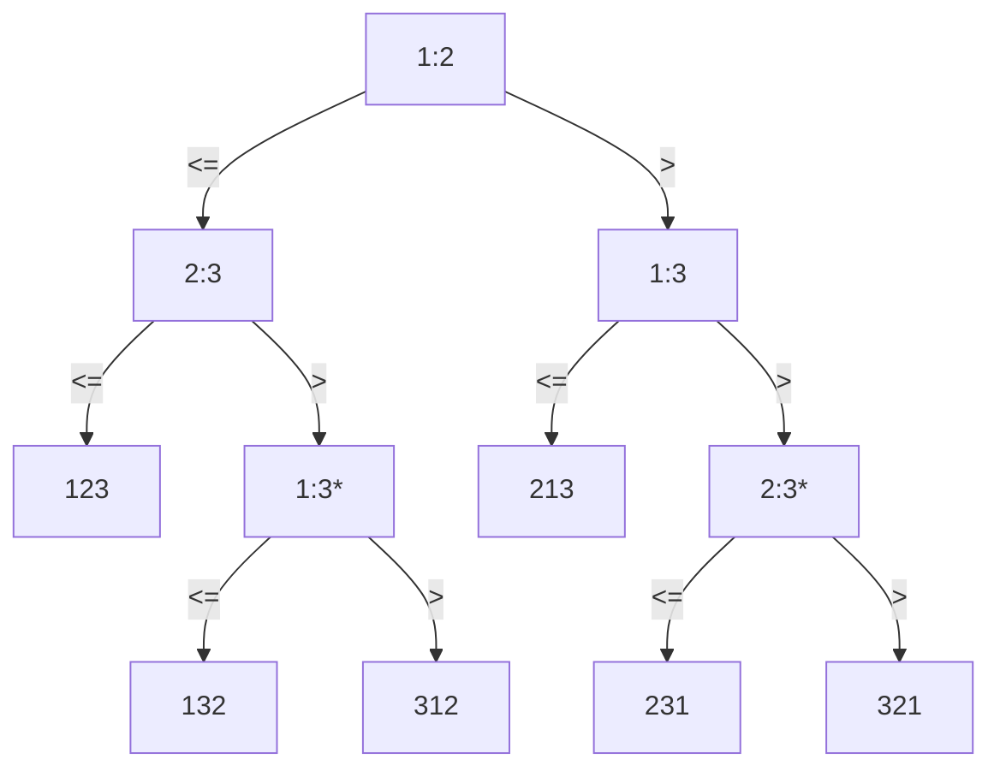

##### what is important in programming

> performance 性能
>
> cost 成本
>
> correctness 正确性
>
> simplicity 简洁
>
> maintainability 可维护性
>
> stability/robustness 稳定性/健壮性
>
> features/functionality 特性/功能性
>
> modularity 模块化
>
> security 安全
>
> scalability 可扩展性
>
> user-friendliness 用户友好


##### T(n)

- ignore machine-dependent constants
- look at the growth of T(n) as n->∞

 

##### 主定理练习

1. $T(n)=4T(n/2)+n $

   $f(n)=n < n^{log_ba}=n^{log_24}=n^2$

   $T(n)=n^2$

2. $T=4T(n/2)+n^2$

   $f(n)=n^2 = n^{log_ba}=n^{log_24}=n^2$

   $T(n)=n^2logn$

 

##### 斐波那契定理

$\begin{bmatrix}F_{n-1}&F_n\\F_n&F_{n-1}\end{bmatrix}=\begin{bmatrix}1&1\\1&0\end{bmatrix}^n$


##### Decision-tree

sort <$a_1, a_2, a_3$>

1:2 means 1<2



基于比较的排序，大部分都能画出对应的决策树，决策树的高度表示了比较次数，且高度最小为 $nlogn$ ，所以，基于比较的排序算法最优效率为 $\Theta(nlogn)$


##### Counting-Sort

基于计数的排序

```C++
for i = 1 to k
    C[i] = 0
for j = 1 to n
    C[A[j]] ++
// C[i] contains the number of elements equal to i
for i = 2 to k
    C[i] = C[i] + C[i - 1]
// C[i] contains the number of elements less than or equal to i
for j = n downto 1
    B[C[A[j]]] = A[j]
    C[A[j]] = C[A[j]] - 1
```

