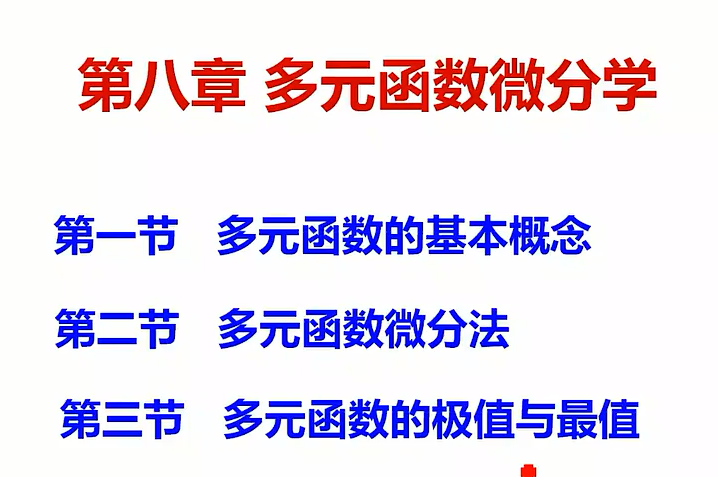
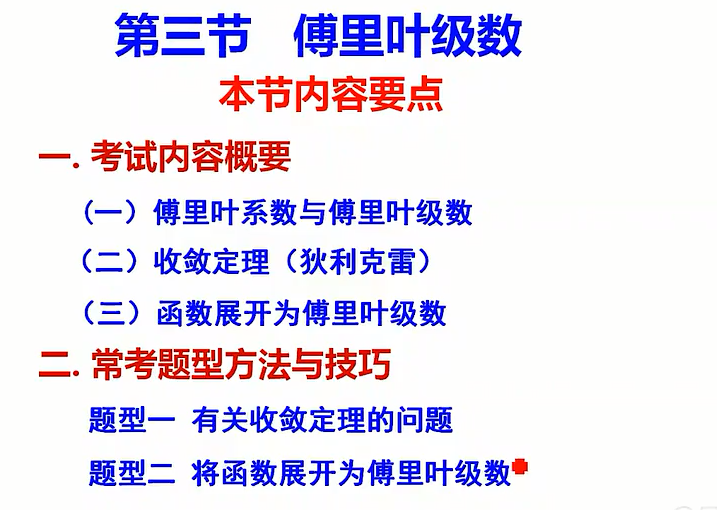

<!-- @import "/root.css" -->
<!-- @import "/plotly.js" -->
<!-- @import "/drawFun.js" -->

# 高数
<br>

---

## 绪论


高数 = 微分 + 积分


导数 = 除法 + 极限
积分 = 乘法 + 极限

<br>

---


## 第一章 函数 极限 连续

<br>

### 函数

```javascript {cmd element="<div id='tester' width=100%></div>"}
draw("tester", i=>Math.sin(1/i), 'y=f(x)', [-3.14, 3.14], 0.0001)
```

<br><hr class=short>

### 极限

\(\lim_{x\to0}x\sin{\frac{1}{x}}=无穷小\times 有界函数 = 0\)

\(\lim_{x\to \infty}x\sin{\frac{1}{x}}=\lim_{x\to \infty}\frac{\sin\frac{1}{x}}{\frac{1}{x}}=1\)

\(\lim_{x\to 0} \frac {\sin( {x\sin { \frac{1}{x} } } ) } { {x \sin{ \frac{1} {x} }  }}\) 不存在

\(x\rightarrow0\)时，\({x\sin{\frac{1}{x}}}\)存在无数个间断点，但极限定义要求0的去心领域处处有定义

#### 两个重要极限
\(\lim_{x\to 0}(1+x)^\frac{1}{x}=e\)
\(\lim_{x\to 0}\frac{\sin x}{x}=1\)


#### 求极限


<br><hr class=short>


第一章习题

第一章重点：求极限


<br>

---


## 第二章 导数与微分

<br>


<br><hr>

## 第三章 微分中值定理及导数应用

<br>


<br><hr>

## 第四章 不定积分

<br>


<br><hr>

## 第五章 定积分与反常积分

<br>


<br>

### 反常积分


<br><hr>

## 第六章 定积分应用

<br>


<br><hr>


## 第七章 定积分应用

<br>


<br><hr>

## 第八章 多元函数微分学

<br>




<br><hr>

## 第九章 二重积分

<br>

 

<br><hr>

## 第十章 无穷级数

<br>




<br><hr>

## 第十一章 向量代数与空间解析几何及多元微分学在几何上的应用

<br>


<br><hr>

## 第十二章 多元积分学及其应用

<br>


