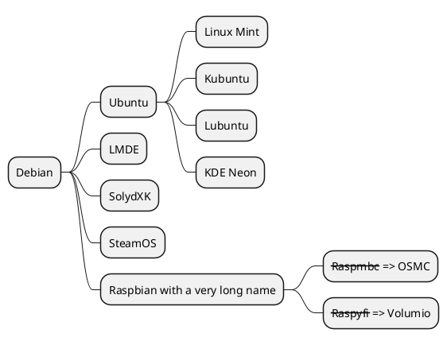

<br>
<br>
<br>
<br>
<br>
<br>


### 终于能跑 js 啦


<script>
    function test() {
        document.getElementById("btn").innerHTML = "bbb";
    }
</script>

<button id="btn" onclick="test()">aaa</button>

---

<br>

## 输出到文件和行数


```cpp {cmd=run output=markdown class="line-numbers"}
cout << "AAAAA";
```


---

<br>


!!! note This is the admonition title
    This is the admonition body

---

<br>

## python 的绘图

```python {cmd=true matplotlib=true}
import matplotlib.pyplot as plt
plt.plot([1,2,3,4])
plt.show() # show figure
```

---

<br>





<div style=background-color:white>

```wavedrom
{ signal: [
  { name: "pclk", wave: 'p.......' },
  { name: "Pclk", wave: 'P.......' },
  { name: "nclk", wave: 'n.......' },
  { name: "Nclk", wave: 'N.......' },
  {},
  { name: 'clk0', wave: 'phnlPHNL' },
  { name: 'clk1', wave: 'xhlhLHl.' },
  { name: 'clk2', wave: 'hpHplnLn' },
  { name: 'clk3', wave: 'nhNhplPl' },
  { name: 'clk4', wave: 'xlh.L.Hx' },
]}
```

</div>

<br>

```vega-lite
{
  "$schema": "https://vega.github.io/schema/vega-lite/v5.json",
  "data": {"url": "https://vega.github.io/schema/vega-lite/data/movies.json"},
  "transform": [{
    "filter": {"and": [
      {"field": "IMDB Rating", "valid": true},
      {"field": "Rotten Tomatoes Rating", "valid": true}
    ]}
  }],
  "mark": "rect",
  "width": 300,
  "height": 200,
  "encoding": {
    "x": {
      "bin": {"maxbins":60},
      "field": "IMDB Rating",
      "type": "quantitative"
    },
    "y": {
      "bin": {"maxbins": 40},
      "field": "Rotten Tomatoes Rating",
      "type": "quantitative"
    },
    "color": {
      "aggregate": "count",
      "type": "quantitative"
    }
  },
  "config": {
    "view": {
      "stroke": "transparent"
    }
  }
}
```

<br>

  ```ditaa {cmd args=["-E"]}
  +--------+   +-------+    +-------+
  |        | --+ ditaa +--> |       |
  |  Text  |   +-------+    |diagram|
  |Document|   |!magic!|    |       |
  |     {d}|   |       |    |       |
  +---+----+   +-------+    +-------+
      :                         ^
      |       Lots of work      |
      +-------------------------+
  ```


<br>
<br>
<br>
<br>
<br>
<br>
<br>
<br>
