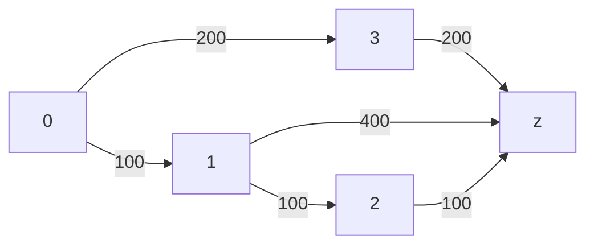

<br>
<br>
<br>
<br>
<br>


```mermaid
graph LR;
0 -->|200| 3
3 -->|200| z
0 -->|100| 1
1 -->|100| 2
1 -->|400| z
2 -->|100| z
```


```cpp {cmd=run}
vector<int> nums{0,1,2,3,4,5,6,7,8,9};
vector<int>::iterator it = nums.begin();
cout << *(it+3);
```
