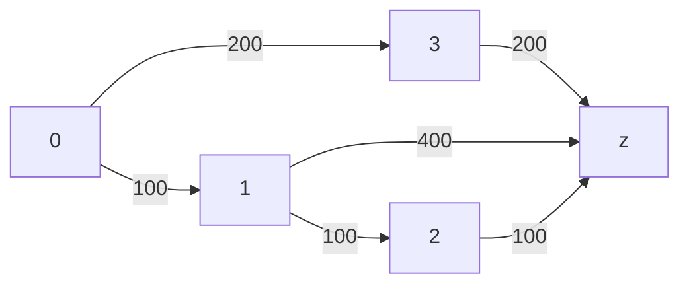
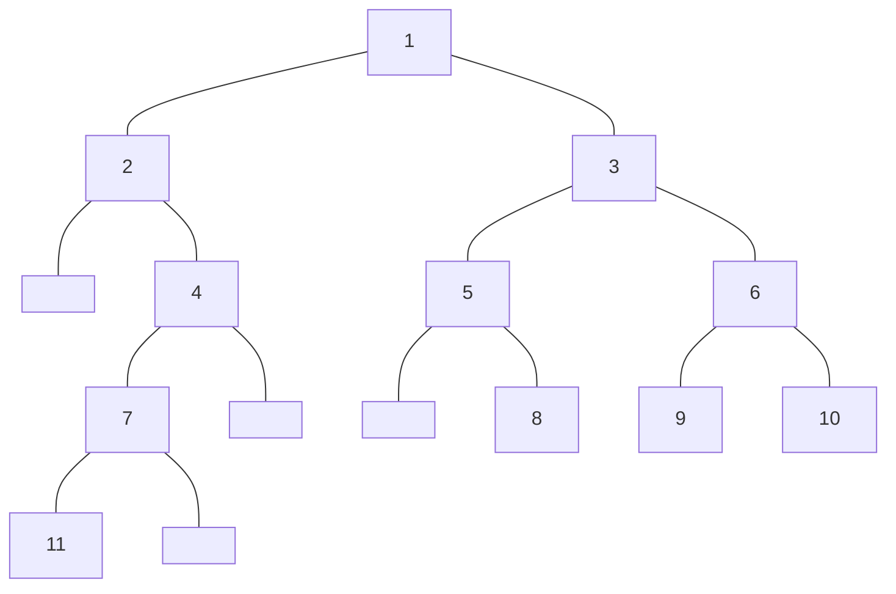

<br>
<br>
<br>
<br>
<br>




```cpp {cmd=run}
vector<int> nums{0,1,2,3,4,5,6,7,8,9};
vector<int>::iterator it = nums.begin();
cout << *(it+3);
```

```cpp {cmd=run}
//sf
//entry
ListNode<int> *head = nullptr;
input >> head;
if(input)
    output << head;
//test
[1,2,3,4,5]
```

```cpp {cmd=run modify_source}
//sf
//entry
TreeNode<int> *root = nullptr;
input >> root;
if(input && root)
    output << root << endl << root->toMermaid();
//test
[1,2,3,null,4,5,6,7,null,null,8,9,10,11]
```

<!-- code_chunk_output -->

[1,2,3,4,5,6,7,8,9,10,11]



-------------------
average time: 0 ms


<!-- /code_chunk_output -->
