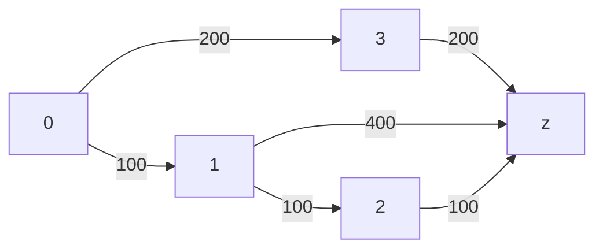
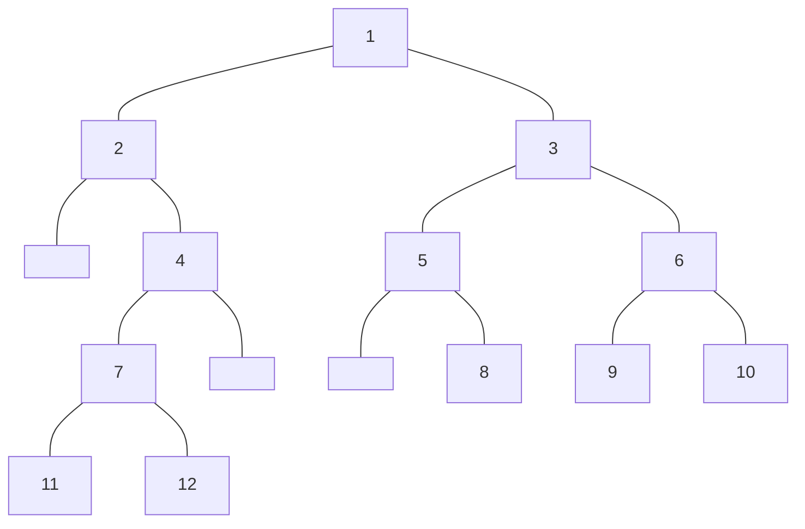
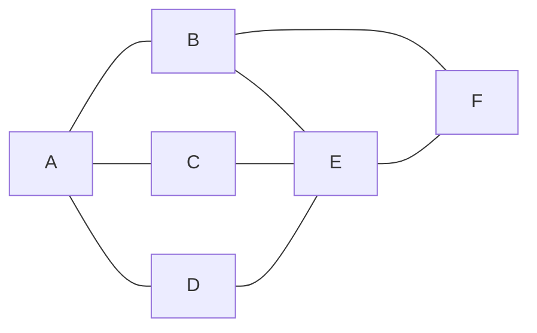

<style>
*{
    font-family:consolas;
}
html body h2{
    color:#a4f3d1;
    text-align:center;
}
html body h3{
    color:#e06666;
}
html body h4{
    color:pink;
}
html body h5{
    color:#e4e79b;
}
.short {
    width:60%;
    background-color:rgba(0,0,0,0);
    border-bottom:4px dotted #515151;
}
.code-output {
    background-color: #323232;
    padding: .8em;
    margin: 1em 0px;
}
.code-hr {
    margin:3em 0px .5em 0px;
}
</style>
<br>
<br>
<br>
<br>
<br>

```cpp {cmd="run" id="sf" hide}
//sf
```




```cpp {cmd=run}
vector<int> nums{0,1,2,3,4,5,6,7,8,9};
vector<int>::iterator it = nums.begin();
cout << *(it+3);
```

```cpp {cmd=run}
//sf
//entry
ListNode<int> *head = nullptr;
input >> head;
if(input)
    output << head;
//test
[1,2,3,4,5]
```

```cpp {cmd=run modify_source}
//sf
//entry
TreeNode<int> *root = nullptr;
input >> root;
if(input && root){
    begin_out(output) << root << endl << root->toMermaid();
}
info = end_out;
//test
[1,2,3,null,4,5,6,7,null,null,8,9,10,11,12]
```

<!-- code_chunk_output -->

<div class=code-output> 

[1,2,3,4,5,6,7,8,9,10,11,12]



<hr class=code-hr>average time: 0 ms
</div>

<!-- /code_chunk_output -->

<style>

html body code {
    color: #83ee73;
}

</style>
`find()`


```cpp {cmd=run line-numbers continue=sf}
string DepthFirstSearch(vector<string>& V, vector<vector<int>>& E) {
    vector<bool> visit(V.size(), false);
    queue<int> S;
    stringstream res("");
    S.push(0);
    while (!S.empty()) {
        int i = S.front();
        S.pop();
        if(visit[i]) continue;
        res << V[i] <<' ';
        visit[i] = true;
        for (int j = 0; j < E[i].size(); ++j) {
            if (E[i][j]) {
                S.push(j);
            }
        }
    }
    return res.str();
}
```
```cpp {cmd=run continue hide}
//entry
vector<int> v(10000000, 0);
int a;
input >> a;
//test
```
```cpp {cmd=run continue}
0
```


```cpp {cmd=run modify_source}
//sf
//entry
modify_source = true;
Graph<string> graph;
input >> graph;
if(input)
    output << graph.toMermaid();
//test
[A,B,C,D,E,F]
[
    [0,1,1,1,0,0],
    [1,0,0,0,1,1],
    [1,0,0,0,1,0],
    [1,0,0,0,1,0],
    [0,1,1,1,0,1],
    [0,1,0,0,1,0]
]
```

<!-- code_chunk_output -->

<div class=code-output> 




<hr class=code-hr> average time: 0 ms


</div> 


<!-- /code_chunk_output -->
