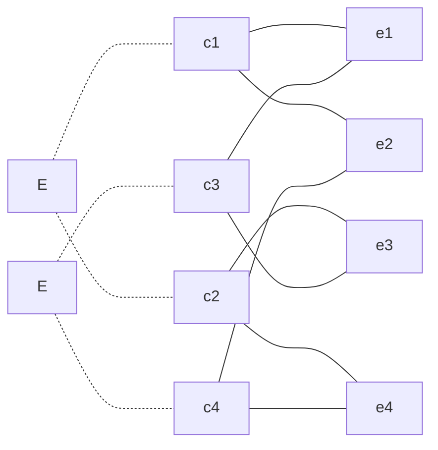

原因：

c1 : 年薪制员工
c2 : 非年薪制员工
c3 : 严重过失
c4 : 过失

结果：

e1 : 扣年终风险金 4%
e2 : 扣年终风险金 2%
e3 : 扣月薪资 8%
e4 : 扣月薪资 4%

|                                        |           1           |           2           |           3           |           4           |           5           |           6           |           7           |           8           |
| :------------------------------------: | :-------------------: | :-------------------: | :-------------------: | :-------------------: | :-------------------: | :-------------------: | :-------------------: | :-------------------: |
|      条件 c1 c2 c3 c4      |  0 0 - -  |  - - 0 0  |  1 1 - -  |  - - 1 1  |  0 1 0 1  |  0 1 1 0  |  1 0 0 1  |  1 0 1 0  |
| 动作 e1 e2 e3 e4 不可能 |      √ |      √ |      √ |      √ |     √  |    √   |   √    |  √     |
|                测试用例                |                  |                  |                  |                  |     非年薪，过失      |   非年薪，严重过失    |      年薪，过失       |    年薪，严重过失     |

 
 
 

原因：

