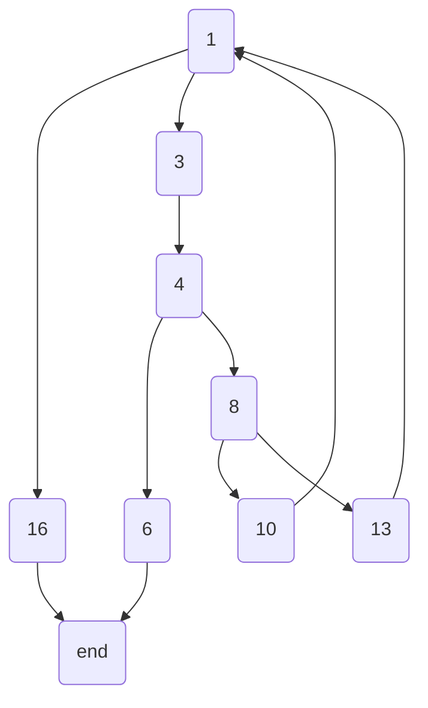

```cpp{cmd class=line-numbers}
while(low <= high)
{
    middle = (low + high) / 2;
    if (array[middle] == key)
    {
        return middle;
    } else 
    if (array[middle] < key)
    {
        low = middle + 1;
    } else
    {
        high = middle - 1;
    }
}
return -1;
```

### 流图：



### 复杂度：
V(G) = P + 1 = 3 + 1 = 4
V(G) = E - N + 2 = 11 - 9 + 2 = 4

### 独立路径：

路径1 : 1 -> 16
路径2 : 1 -> 3 -> 4 -> 6
路径3 : 1 -> 3 -> 4 -> 8 -> 10 -> 1 ->...
路径4 : 1 -> 3 -> 4 -> 8 -> 13 -> 1 ->...

### 测试用例：

|    测试用例     | 路径  | 期望输出 |
| :-------------: | :---: | :------: |
|      [] 1       | 路径1 |    -1    |
|    [1,2,3] 2    | 路径2 |    1     |
| [1,2,3,4,5,6] 5 | 路径3 |    4     |
| [1,3,4,5,6,7] 2 | 路径4 |    -1    |
