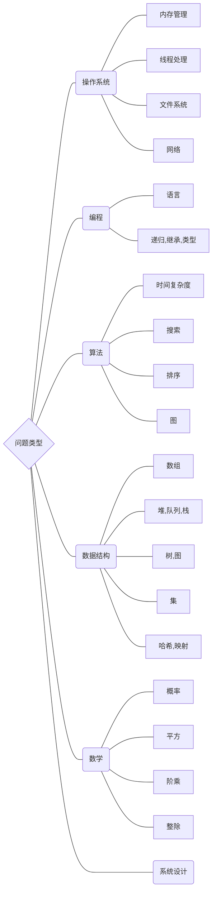

<!-- @import "_pre.css" -->

## 一些笔记

### 面试问题

https://leetcode-cn.com/leetbook/read/top-interview-questions/xmted6/

  

### 算法与数据结构

https://leetcode-cn.com/leetbook/read/top-interview-questions/xmted6/

#### 算法

1. 排序算法：快排、归并、计数
2. 搜索算法：回溯、递归、剪枝技巧
3. 图论：最短路、最小生成树、网络流建模
4. 动态规划：背包问题、最长子序列、计数问题
5. 技巧：分治、倍增、二分、贪心

#### 数据结构

1. 数组与链表：单/双向链表、跳舞链
2. 栈与队列
3. 树与图：最近公共祖先、并查集
4. 哈希表
5. 堆：大/小根堆、可并堆
6. 字符串：字典树、后缀树

 
 
 

---
